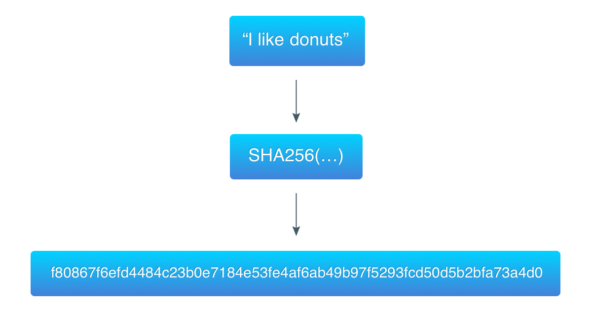
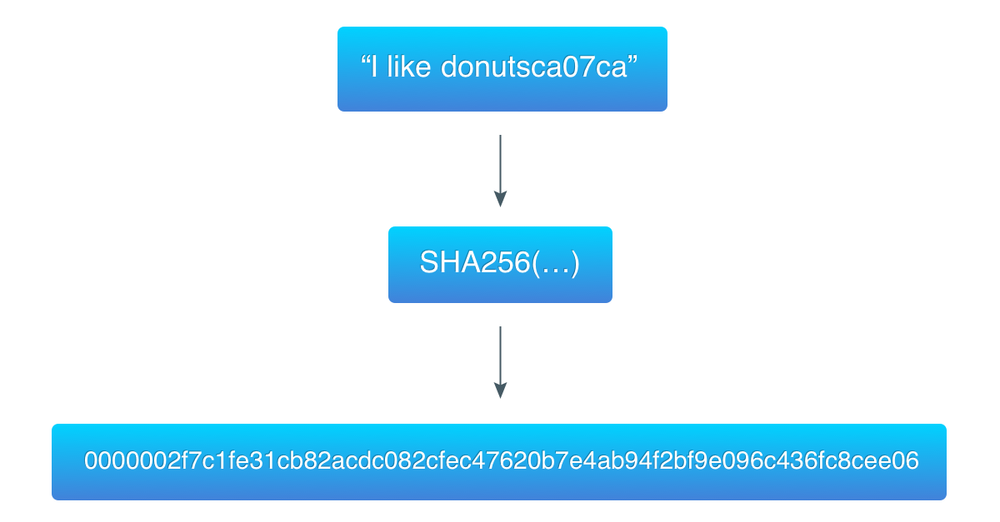

## Lập trình Blockchain với Golang. Part 2: Proof-of-work

>Bài dịch từ _Building Blockchain in Go_ của tác giả _Ivan Kuznetsov_. Khi sử dụng vui lòng trích dẫn nguồn [@hlongvu](https://github.com/hlongvu/blockchain-go-vietnamese)


### Mục lục

1. [Lập trình Blockchain với Golang. Part 1: Cơ bản](https://github.com/hlongvu/blockchain-go-vietnamese/blob/master/Blockchain-go-part1.md)
2. [Lập trình Blockchain với Golang. Part 2: Proof-of-work](https://github.com/hlongvu/blockchain-go-vietnamese/blob/master/Blockchain-go-part2.md)
3. [Lập trình Blockchain với Golang. Part 3: Lưu trữ và tương tác CLI](https://github.com/hlongvu/blockchain-go-vietnamese/blob/master/Blockchain-go-part3.md)
4. [Lập trình Blockchain với Golang. Part 4: Transactions 1](https://github.com/hlongvu/blockchain-go-vietnamese/blob/master/Blockchain-go-part4.md)
5. [Lập trình Blockchain với Golang. Part 5: Address](https://github.com/hlongvu/blockchain-go-vietnamese/blob/master/Blockchain-go-part5.md) 
6. [Lập trình Blockchain với Golang. Part 6: Transaction 2](https://github.com/hlongvu/blockchain-go-vietnamese/blob/master/Blockchain-go-part6.md)
7. [Lập trình Blockchain với Golang. Part 7: Network](https://github.com/hlongvu/blockchain-go-vietnamese/blob/master/Blockchain-go-part7.md)

### Giới thiệu
Trong phần trước chúng ta đã xây dựng một cấu trúc dữ liệu đơn giản, là phần cốt lõi của blockchain. Chúng ta đã có thể thêm các block vào blockchain theo kiểu linked-list: mỗi block trỏ tới block liền kề trước đó. Tuy nhiên, blockchain của chúng ta mắc phải một lỗi cực kì nghiêm trọng: thêm block vào chuỗi hết sức dễ dàng. Một trong những chìa khoá quan trọng trong thiết kế của Bitcoin đó là việc thêm các block phải trải qua nhiều công sức tính toán. Trong phần này chúng ta sẽ sửa chữa khiếm khuyết trên.

### Proof-of-work

Một trong những ý tưởng cốt lõi của blockchain đó là bất kì ai cũng phải bỏ ra nhiều công sức tính toán thì mới có thể thêm dữ liệu vào blockchain. Sự an toàn và đồng nhất của blockchain là nhờ thiết kế này. Thêm vào đó, khi bỏ công sức ra để thêm dữ liệu vào blockchain thì người tham gia đó sẽ được trao một phần thưởng (đây là lý do mọi người tham gia đào coin).

Cơ chế này tương tự trong đời thực: mỗi người bỏ công sức ra làm việc thì sẽ kiếm được tiền để chu cấp cho cuộc sống. Trong hệ thống blockchain, một số người tham gia đào coin (miners) phải liên tục tính toán để giúp hệ thống tiếp tục hoạt động, thêm block vào chuỗi và nhận phần thưởng (là coin đào được). Kết quả của việc đào coin (mining) là mỗi block được thêm vào blockchain sẽ càng thêm an toàn, giúp toàn bộ dữ liệu blockchain được ổn định và khó bị giả mạo. Nhưng đáng chú ý là những miners này phải chứng minh là họ đã bỏ công sức ra để mining.

Việc "bỏ công sức tính toán và chứng minh mình đã làm" này được gọi là **proof-of-work**. Việc này rất khó và thậm chí nhiều máy tính tốc độ cao cũng không thể thực hiện nhanh chóng. Thêm nữa, độ khó của công việc còn được tăng theo thời gian nhằm đảm bảo chỉ có 6 block được đào trong mỗi giờ. Trong Bitcoin, công việc là tìm ra một mã hash thoả mãn một số điều kiện. Mã hash thoả mãn đó được gọi là proof.

Một chú ý nữa, thuật toán **Proof-of-work** phải thoả mãn một điều kiện: tìm ra proof thì khó, nhưng xác nhận proof đó là đúng (verify) thì phải nhanh và dễ. Khi một người tìm ra proof đó và đưa cho những người trong mạng lưới kiểm tra thì họ có thể dễ dàng verify là đúng.

### Hashing

Mục này chúng ta sẽ tìm hiểu về hàm băm (Hashing). Nếu bạn đã quen thuộc thì có thể bỏ qua.

Hashing là tiến trình để lấy mã băm (hash) của một dữ liệu nhất định. Mỗi hash đối với một dữ liệu (data) là duy nhất. Hàm băm (hash function) là một hàm với đầu vào là dữ liệu có độ lớn tuỳ ý, đầu ra là một hash có kích thước cố định. Sau đây là những tính chất của hàm băm:

1. Dữ liệu gốc không thể tái tạo lại chỉ dựa vào hash của dữ liệu đó. Vì thế hash không phải là mã hoá.
2. Một dữ liệu cố định thì chỉ sinh ra một hash cố định và không trùng lặp với hash của dữ liệu khác.
3. Thay đổi thậm chí 1 bit dữ liệu nhỏ trong data cũng sinh ra một hash tương ứng hoàn toàn khác ban đầu.




Hàm băm được sử dụng nhiều để kiểm tra tính toàn vẹn của dữ liệu. Ví dụ một số phần mềm sẽ có mã hash đi kèm để kiểm tra gói phần mềm chưa qua chỉnh sửa. Khi tải gói phần mềm về bạn có thể tính lại hash của nó đó để so sánh với mã hash mà nhà phát triển phần mềm cung cấp.

Trong hệ thống blockchain, Hashing được sử dụng để đảm bảo tính toàn vẹn của các block. Đầu vào của hàm băm lại có thêm mã hash của block liền kề trước, khiến cho việc thay đổi một block trong toàn bộ chuỗi là không thể (hoặc gần như không thể): Một khi một block thay đổi thì phải tính toán lại toàn bộ hash của block đó và các block liên tiếp phía sau. 

>Các hash tính toán lại lại phải luôn đảm bảo proof-of-work, khiến cho khối lượng tính toán vô cùng lớn - Người dịch

### Hashcash

Bitcoin sử dụng [Hashcash](https://en.wikipedia.org/wiki/Hashcash), một thuật toán Proof-of-Work vốn dùng để ngăn chặn thư rác. Thuật toán được chia làm các bước:

1. Lấy các dữ liệu đã biết (trong email thì là địa chỉ người nhận, trong Bitcoin thì là block headers).
2. Thêm một biến đếm (counter) vào dữ liệu đó, khỏi đầu bằng 0.
3. Tính hash của **data + counter**
4. Kiểm tra xem hash tính được có thoả mãn điều kiện không:
 	- Nếu thoả mãn thì hash đó là kết quả
 	- Nếu không thoả mãn, tăng biến đếm counter lên và tiếp tục làm lại bước 3, 4
 	
Việc lặp lại tính toán với biến đếm counter cho đến khi tìm được hash thoả mãn này là một quá trình tính toán với khối lượng lớn.

Bây giờ hãy xem điều kiện hash thoả mãn là gì. Trong phiên bản gốc của Hashcash, điều kiện một hash được chấp nhận là "20 bit đầu tiên của hash phải bằng 0". Ở Bitcoin, điều kiện này lại được thay đổi theo thời gian, bởi, theo thiết kế, mỗi block phải được tạo ra trong 10 phút, dù cho khả năng tính toán càng ngày càng lớn theo thời gian và số lượng miners.

Ví dụ với thuật toán này, data ban đầu là (“I like donuts”) khi kết hợp với counter là ca07ca thì kết quả hash thu được có 3 bytes bằng 0:
	


ca07ca là giá trị counter trong hệ số 16, trong hệ cơ số 10 nó tương đương 13240266

> Như vậy vòng lặp thuật toán phải chạy tới counter = 13240266 mới tìm ra một hash có 3 byte bằng 0. Điều đó cho thấy bạn phải tốn nhiều công sức tính toán thì mới tìm đc một hash thoả mãn điều kiện - Người dịch


### Code

Như vậy chúng ta đã điểm qua phần thiết kế, hãy bắt tay xây dựng phần code. Đầu tiên chúng ta định nghĩa độ khó:

```
const targetBits = 24
```

Ở Bitcoin thì targetBits là một biến nằm trong block header, thể hiện độ khó của block đó khi được đào. Chúng ta không xây dựng phần thay đổi độ khó cho blockchain đơn giản này, nên targetBits được thể hiện là một hằng số.

24 cũng là một hằng số được chọn ngẫu nhiên, mục đích của chúng ta là chọn một độ khó bé hơn 256 bits, không nhỏ quá và cũng không quá lớn vì targetBits càng lớn thì độ khó càng tăng thêm nhiều lần.

```
type ProofOfWork struct {
	block  *Block
	target *big.Int
}

func NewProofOfWork(b *Block) *ProofOfWork {
	target := big.NewInt(1)
	target.Lsh(target, uint(256-targetBits))

	pow := &ProofOfWork{b, target}

	return pow
}
```

Ở đây **ProofOfWork** là một struct chứa pointer tới 1 block và một target. Biến target này chính là độ khó. Chúng ta sử dụng big.Int để so sánh hash với target: chuyển hash thành big.Int và kiểm tra xem hash có bé hơn target hay không. 

Trong hàm NewProofOfWork chúng ta khởi tạo target bằng 1 và shift left (dịch trái) 256 - targetBits bits. 256 là độ dài của một hash sinh ra bởi thuật toán băm SHA-256. Biểu diễn của target trong hệ 16 là:

```
0x0000010000000000000000000000000000000000000000000000000000000000
```

So sánh với 2 mã hash trong 2 ví dụ trước:

```
0fac49161af82ed938add1d8725835cc123a1a87b1b196488360e58d4bfb51e3
0000010000000000000000000000000000000000000000000000000000000000
0000008b0f41ec78bab747864db66bcb9fb89920ee75f43fdaaeb5544f7f76ca
```
Mã hash đầu tiên sinh ra từ data (“I like donuts”) lớn hơn target, do vậy không thoả mãn điều kiện. Mã hash thứ 2 sinh ra từ data (“I like donutsca07ca”) nhỏ hơn target, vì vậy nó thoả mãn điều kiện.

Bạn có thể hình dung target là chặn trên, nếu hash bé hơn chặn trên này thì thoả mãn, ngược lại thì không. Khi chặn trên này ngày càng hạ xuống, thì số lượng hash thoả mãn sẽ giảm xuống, đồng nghĩa với việc độ khó tăng lên và cần nhiều tính toán hơn để tìm hash.

Hàm dưới đây chuẩn bị data để tìm hash:

```
func (pow *ProofOfWork) prepareData(nonce int) []byte {
	data := bytes.Join(
		[][]byte{
			pow.block.PrevBlockHash,
			pow.block.Data,
			IntToHex(pow.block.Timestamp),
			IntToHex(int64(targetBits)),
			IntToHex(int64(nonce)),
		},
		[]byte{},
	)

	return data
}
```

Chúng ta đơn giản chỉ nhập phần block với targetBits và nonce thành một mảng bytes, hàm hash sẽ thực hiện trên mảng bytes này.

```
func (pow *ProofOfWork) Run() (int, []byte) {
	var hashInt big.Int
	var hash [32]byte
	nonce := 0

	fmt.Printf("Mining the block containing \"%s\"\n", pow.block.Data)
	for nonce < maxNonce {
		data := pow.prepareData(nonce)
		hash = sha256.Sum256(data)
		fmt.Printf("\r%x", hash)
		hashInt.SetBytes(hash[:])

		if hashInt.Cmp(pow.target) == -1 {
			break
		} else {
			nonce++
		}
	}
	fmt.Print("\n\n")

	return nonce, hash[:]
}
```

Chúng ta sẽ chạy một vòng lặp liên tục cho tới maxNonce (bằng math.MaxInt64). Thực tế thì chúng ta sẽ tìm ra hash thoả mãn sớm, không đến mức nonce phải tới giá trị math.MaxInt64 cực lớn này. Trong vòng lặp này chúng ta làm những việc sau:
1. Chuẩn bị data
2. Hash data với thuật toán SHA-256
3. Chuyển hash sang big.Int
4. So sánh con số nhận được với target

Trong phần 1 chúng ta có hàm SetHash của Block, giờ chúng ta thay thế bằng hash sinh ra từ proof-of-work này:

```
func NewBlock(data string, prevBlockHash []byte) *Block {
	block := &Block{time.Now().Unix(), []byte(data), prevBlockHash, []byte{}, 0}
	pow := NewProofOfWork(block)
	nonce, hash := pow.Run()

	block.Hash = hash[:]
	block.Nonce = nonce

	return block
}
```

Biến nonce giờ được lưu trong Block, cần để verify lại kết quả một cách dễ dàng. Struct Block giờ được cập nhật lại như sau:

```
type Block struct {
	Timestamp     int64
	Data          []byte
	PrevBlockHash []byte
	Hash          []byte
	Nonce         int
}
```

Và đây là kết quả khi chạy lại chương trình:

```
Mining the block containing "Genesis Block"
00000041662c5fc2883535dc19ba8a33ac993b535da9899e593ff98e1eda56a1

Mining the block containing "Send 1 BTC to Ivan"
00000077a856e697c69833d9effb6bdad54c730a98d674f73c0b30020cc82804

Mining the block containing "Send 2 more BTC to Ivan"
000000b33185e927c9a989cc7d5aaaed739c56dad9fd9361dea558b9bfaf5fbe

Prev. hash:
Data: Genesis Block
Hash: 00000041662c5fc2883535dc19ba8a33ac993b535da9899e593ff98e1eda56a1

Prev. hash: 00000041662c5fc2883535dc19ba8a33ac993b535da9899e593ff98e1eda56a1
Data: Send 1 BTC to Ivan
Hash: 00000077a856e697c69833d9effb6bdad54c730a98d674f73c0b30020cc82804

Prev. hash: 00000077a856e697c69833d9effb6bdad54c730a98d674f73c0b30020cc82804
Data: Send 2 more BTC to Ivan
Hash: 000000b33185e927c9a989cc7d5aaaed739c56dad9fd9361dea558b9bfaf5fbe
```
Bạn có thể thấy các hash đã có các bytes bằng 0 ở đầu, và phải mất 1 lúc mới tìm được các hash đó.

Còn một điều nữa, verify lại kết quả của proof-of-work như thế nào?

```
func (pow *ProofOfWork) Validate() bool {
	var hashInt big.Int

	data := pow.prepareData(pow.block.Nonce)
	hash := sha256.Sum256(data)
	hashInt.SetBytes(hash[:])

	isValid := hashInt.Cmp(pow.target) == -1

	return isValid
}
```
Như bạn có thể thấy biến nonce được lưu lại giúp việc verify trở nên dễ dàng.

Kiểm tra lại blockchain của chúng ta bằng hàm Validate():

```
func main() {
	...

	for _, block := range bc.blocks {
		...
		pow := NewProofOfWork(block)
		fmt.Printf("PoW: %s\n", strconv.FormatBool(pow.Validate()))
		fmt.Println()
	}
}

```
Kết quả:

```
...

Prev. hash:
Data: Genesis Block
Hash: 00000093253acb814afb942e652a84a8f245069a67b5eaa709df8ac612075038
PoW: true

Prev. hash: 00000093253acb814afb942e652a84a8f245069a67b5eaa709df8ac612075038
Data: Send 1 BTC to Ivan
Hash: 0000003eeb3743ee42020e4a15262fd110a72823d804ce8e49643b5fd9d1062b
PoW: true

Prev. hash: 0000003eeb3743ee42020e4a15262fd110a72823d804ce8e49643b5fd9d1062b
Data: Send 2 more BTC to Ivan
Hash: 000000e42afddf57a3daa11b43b2e0923f23e894f96d1f24bfd9b8d2d494c57a
PoW: true
```


### Kết luận
Blockchain chúng ta xây dựng đang dần giống với thực tế: thêm block mới cần có proof-of-work, là khởi đầu cho việc mining. Nhưng blockchain chúng ta còn thiếu nhiều tính năng thiết yếu khác: chưa lưu trữ data, chưa có wallet (ví), address (địa chỉ), transaction (giao dịch) và chưa có consensus (luật đồng thuận). Trong những phần tới chúng ta sẽ đề cập đến những vấn đề này.

### Links

1. Full source code [https://github.com/Jeiwan/blockchain_go/tree/part_2](https://github.com/Jeiwan/blockchain_go/tree/part_2)
2. Blockchain hashing algorithm  [https://en.bitcoin.it/wiki/Block_hashing_algorithm](https://en.bitcoin.it/wiki/Block_hashing_algorithm)
3. Proof of work [https://en.bitcoin.it/wiki/Proof_of_work](https://en.bitcoin.it/wiki/Proof_of_work)
4. Hashcash [https://en.bitcoin.it/wiki/Hashcash](https://en.bitcoin.it/wiki/Hashcash)

### Mục lục

1. [Lập trình Blockchain với Golang. Part 1: Cơ bản](https://github.com/hlongvu/blockchain-go-vietnamese/blob/master/Blockchain-go-part1.md)
2. [Lập trình Blockchain với Golang. Part 2: Proof-of-work](https://github.com/hlongvu/blockchain-go-vietnamese/blob/master/Blockchain-go-part2.md)
3. [Lập trình Blockchain với Golang. Part 3: Lưu trữ và tương tác CLI](https://github.com/hlongvu/blockchain-go-vietnamese/blob/master/Blockchain-go-part3.md)
4. [Lập trình Blockchain với Golang. Part 4: Transactions 1](https://github.com/hlongvu/blockchain-go-vietnamese/blob/master/Blockchain-go-part4.md)
5. [Lập trình Blockchain với Golang. Part 5: Address](https://github.com/hlongvu/blockchain-go-vietnamese/blob/master/Blockchain-go-part5.md) 
6. [Lập trình Blockchain với Golang. Part 6: Transaction 2](https://github.com/hlongvu/blockchain-go-vietnamese/blob/master/Blockchain-go-part6.md)
7. [Lập trình Blockchain với Golang. Part 7: Network](https://github.com/hlongvu/blockchain-go-vietnamese/blob/master/Blockchain-go-part7.md)

