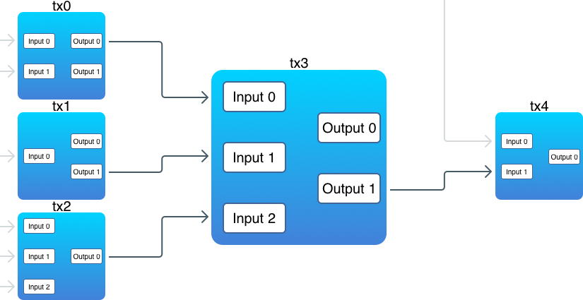

## Lập trình Blockchain với Golang. Part 4: Transactions 1

>Bài dịch từ _Building Blockchain in Go_ của tác giả _Ivan Kuznetsov_. Khi sử dụng vui lòng trích dẫn nguồn [@hlongvu](https://github.com/hlongvu/blockchain-go-vietnamese)


### Mục lục

1. [Lập trình Blockchain với Golang. Part 1: Cơ bản](https://github.com/hlongvu/blockchain-go-vietnamese/blob/master/Blockchain-go-part1.md)
2. [Lập trình Blockchain với Golang. Part 2: Proof-of-work](https://github.com/hlongvu/blockchain-go-vietnamese/blob/master/Blockchain-go-part2.md)
3. [Lập trình Blockchain với Golang. Part 3: Lưu trữ và tương tác CLI](https://github.com/hlongvu/blockchain-go-vietnamese/blob/master/Blockchain-go-part3.md)
4. [Lập trình Blockchain với Golang. Part 4: Transactions 1](https://github.com/hlongvu/blockchain-go-vietnamese/blob/master/Blockchain-go-part4.md)
5. [Lập trình Blockchain với Golang. Part 5: Address](https://github.com/hlongvu/blockchain-go-vietnamese/blob/master/Blockchain-go-part5.md) 
6. [Lập trình Blockchain với Golang. Part 6: Transaction 2](https://github.com/hlongvu/blockchain-go-vietnamese/blob/master/Blockchain-go-part6.md)
7. [Lập trình Blockchain với Golang. Part 7: Network](https://github.com/hlongvu/blockchain-go-vietnamese/blob/master/Blockchain-go-part7.md)

### Giới thiệu
Transaction là trái tim của Bitcoin và nhiệm vụ duy nhất của blockchain là lưu trữ transaction một cách an toàn và tin cậy,để không ai có thể thay đổi chúng sau khi được tạo. Phần này chúng ta sẽ xây dựng transaction. Nhưng đây là một topic khá lớn nên sẽ được chia thành 2 phần. Phần 1 này chúng ta sẽ xây dựng kiến trúc tổng thể của transaction và sẽ đi vào cụ thể ở phần tới.

Hàm lượng code thay đổi là rất lớn nên các bạn có thể theo dõi tất cả ở [đây](https://github.com/Jeiwan/blockchain_go/compare/part_3...part_4#files_bucket)

### There is no spoon 
> Quote từ phim [Ma trận](https://www.youtube.com/watch?v=uAXtO5dMqEI)

Nếu bạn từng xây dựng một web app, để có phần thanh toán (payment) thường thì bạn phải có 2 tables này trong DB: **accounts** và **transactions**. Một account thường sẽ lưu thông tin user, bao gồm thông tin cá nhân, số dư tài khoản, và mỗi transaction sẽ là thông tin về việc chuyển tiền từ tài khoản này qua tài khoản kia. Trong Bitcoin, việc thanh toán được thể hiện bằng một cách hoàn toàn khác:

1. Không có accounts
2. Không có balance
3. Không có address
4. Không có coins
5. Không có người gửi và người nhận

Vì Blockchain là một bộ dữ liệu mở, chúng ta hoàn toàn không muốn lưu giữ các thông tin nhạy cảm của người dùng. Coins không có trong các accounts. Transaction thì không phải từ người này qua người kia. Thậm chí không có trường nào để lưu balance. Tất cả chỉ là các transaction.

Vậy trong transaction có gì?

### Bitcoin Transaction
Một transaction là tổng hợp của các inputs và outputs

```
type Transaction struct {
	ID   []byte
	Vin  []TXInput
	Vout []TXOutput
}
```

Inputs của transaction này lại chính là outputs của một transaction trước đó (có một số ngoại lệ, chúng ta sẽ thảo luận sau). Outputs chính là nơi mà coins được lưu giữ. Biểu đồ sau thể hiện mối liên kết giữa các transaction:



Chú ý:

1. Có những output không trỏ tới input nào
2. Trong một transaction, inputs có thể trỏ tới nhiều outputs của nhiều transaction trước
3. Mỗi input phải trỏ tới 1 output

Chúng ta có thể sử dụng các thuật ngữ như "money", "coin","spend","send","account",... nhưng các khái niệm này không tồn tại trong Bitcoin. Các transaction khoá các giá trị (value) lại, và chỉ có người khoá mới mở được khoá này, để có thể "spend" (sử dụng).

### Transaction Outputs
Hãy xem cấu trúc của một transaction output:

```
type TXOutput struct {
	Value        int
	ScriptPubKey string
}
```

Hãy chú ý trường **Value** ở trên, đây chính là coins mà outputs lưu giữ (store). Store chính là khoá value lại với một puzzle (**ScriptPubKey**), đòi hỏi phải giải được mới có quyền sử dụng value này.

Trong thiết kế của Bitcoin, có một ngôn ngữ được sử dụng là *Script*, để định nghĩa logic khoá và mở khoá. Ngôn ngữ này khá sơ khai (được tạo nên có chủ ý nhằm tránh bị hack và dùng sai), và chúng ta không đi sâu vào. Nếu bạn quan tâm có thể tham khảo ở [đây](https://en.bitcoin.it/wiki/Script).

> Bitcoin lưu value theo đơn vị _satoshis_, không phải đơn vị BTC. Mỗi satoshi tương ứng 0.00000001 BTC, là đơn vị nhỏ nhất của Bitcoin.

> Bitcoin cũng có khả năng tạo smart-contract nhờ vào ngôn ngữ Script này

Chúng ta chưa xây dựng address vì thế để tránh các logic về khoá và mở khoá, chúng ta sử dụng ScriptPubKey để lưu một string (address của user)

Một điều quan trọng cần nhớ là output không thể chia nhỏ ra, nghĩa là bạn không thể trỏ tới mỗi 1 phần nhỏ của output. Khi một output được trỏ tới trong transaction thì nó sẽ được sử dụng toàn phần. Nếu giá trị của output đó lớn hơn giá trị cần sử dụng, một phần dư sẽ được tạo ra và gửi lại cho chính chủ. Tương tự với tình huống trong thực tế, khi bạn thanh toán 1$ bằng tờ 5$ thì bạn được trả lại 4$.

### Transaction Inputs
Đây là cấu trúc của một transaction input:

```
type TXInput struct {
	Txid      []byte
	Vout      int
	ScriptSig string
}
```

Như đã đề cập ở phần trên, mỗi input trỏ tới 1 output của transaction khác. **Txid** lưu giữ id của transaction đó, **Vout** là index (vị trí) của output trong transaction đó. **ScriptSig** là một script lưu trữ data để sử dụng cùng với **ScriptPubKey** của output. Nếu data đúng thì output có thể được mở (unlock) và value của output có thể sử dụng để tạo nên output mới. Nếu không đúng, output sẽ không được quyền sử dụng trong input này. Đây là cơ chế giúp một người không thể sử dụng coins của người khác.

Chúng ta chưa xây dựng address, vậy nên **ScriptSig** cũng chỉ lưu một string thể hiện address của user. Phần public key và kiểm tra signature sẽ được đề cập trong hướng dẫn sau.

Tóm tắt lại như sau. Output là nơi "coins" được lưu trữ. Mỗi output đi kèm với một mã khoá. Các transaction phải có ít nhất 1 input và 1 output. Mỗi input trỏ tới 1 output từ transaction khác trước đó và phải có phần **ScriptSig** để mở khoá output đó.

Vậy cái gì có trước: input hay output?

### Con gà và quả trứng

Có input thì mới có output và có output mới có input là vấn đề con gà quả trứng kinh điển. Trong Bitcoin thì output có trước input.

Khi miner đào một block, có một transaction đặc biệt trong block đó gọi là **coinbase transaction**. Đó là transaction không cần có input. Nó tạo ra output từ hư không. Đây chính là phần thưởng mà miner nhận được khi tham gia đào.

Như bạn đã biết, có genesis block ở đầu blockchain. Block này chứa output đầu tiên của blockchain. Output này không cần tới output hay input nào của hệ thống vì trước đó không có gì cả.

Đây là cấu trúc của coinbase transaction:

```
func NewCoinbaseTX(to, data string) *Transaction {
	if data == "" {
		data = fmt.Sprintf("Reward to '%s'", to)
	}

	txin := TXInput{[]byte{}, -1, data}
	txout := TXOutput{subsidy, to}
	tx := Transaction{nil, []TXInput{txin}, []TXOutput{txout}}
	tx.SetID()

	return &tx
}
```

Một coinbase transaction chỉ có 1 input. Trong blockchain của chúng ta nó được định nghĩa là **Txid** rỗng và **Vout = -1**. Đồng thời không có **ScriptSig** mà chỉ là data tuỳ ý.

> Coinbase transaction đầu tiên của Bitcoin lưu giữ thông điệp này: “The Times 03/Jan/2009 Chancellor on brink of second bailout for banks”. [Bạn có thể thấy ở đây](https://blockchain.info/tx/4a5e1e4baab89f3a32518a88c31bc87f618f76673e2cc77ab2127b7afdeda33b?show_adv=true).

 
Hãy chú ý trường **subsidy** ở trên. Đây chính là số coins phần thưởng dành cho miner. Chúng ta lưu với biến hằng số. Tuy nghiên trong Bitcoin thì nó được tính dựa vào số blocks hiện tại. Đào block đầu tiên của Bitcoin bạn nhận được 50 BTC và sau đó cứ **210000** blocks thì sẽ giảm một nửa.


### Lưu trữ Transaction trong Blockchain

Từ giờ mỗi block phải chứa ít nhất một transaction và không thể đào block rỗng nữa. Trường **Data** sẽ được thay bằng mảng transaction:

```
type Block struct {
	Timestamp     int64
	Transactions  []*Transaction
	PrevBlockHash []byte
	Hash          []byte
	Nonce         int
}
```

Các hàm **NewBlock** và **NewGenesisBlock** cũng sẽ được cập nhật lại:

```
func NewBlock(transactions []*Transaction, prevBlockHash []byte) *Block {
	block := &Block{time.Now().Unix(), transactions, prevBlockHash, []byte{}, 0}
	...
}

func NewGenesisBlock(coinbase *Transaction) *Block {
	return NewBlock([]*Transaction{coinbase}, []byte{})
}
```

Hàm tạo blockchain mới cũng được cập nhật:

```
func CreateBlockchain(address string) *Blockchain {
	...
	err = db.Update(func(tx *bolt.Tx) error {
		cbtx := NewCoinbaseTX(address, genesisCoinbaseData)
		genesis := NewGenesisBlock(cbtx)

		b, err := tx.CreateBucket([]byte(blocksBucket))
		err = b.Put(genesis.Hash, genesis.Serialize())
		...
	})
	...
}
```
Hàm này sẽ có tham số là address, là địa chỉ nhận reward cho genesis block.

### Proof-of-work

Thuật toán proof-of-work cũng phải thực hiện trên phần transaction của block, để có thể đảm bảo các transaction này an toàn. Hàm **ProofOfWork.prepareData** sẽ được cập nhật lại:

```
func (pow *ProofOfWork) prepareData(nonce int) []byte {
	data := bytes.Join(
		[][]byte{
			pow.block.PrevBlockHash,
			pow.block.HashTransactions(), // This line was changed
			IntToHex(pow.block.Timestamp),
			IntToHex(int64(targetBits)),
			IntToHex(int64(nonce)),
		},
		[]byte{},
	)

	return data
}
```
Thay vì **pow.block.Data** chúng ta dùng **pow.block.HashTransactions()** được tạo nên từ các transactions:

```
func (b *Block) HashTransactions() []byte {
	var txHashes [][]byte
	var txHash [32]byte

	for _, tx := range b.Transactions {
		txHashes = append(txHashes, tx.ID)
	}
	txHash = sha256.Sum256(bytes.Join(txHashes, []byte{}))

	return txHash[:]
}
```

Chúng ta muốn tất cả các transaction trong block đều được gộp lại và cho ra một hash duy nhất. Để làm được điều này chúng ta hash mỗi transaction rồi ghép lại với nhau, cuối cùng lấy hash của dữ liệu gộp đó.

> Bitcoin sử dụng một kỹ thuật cao hơn, các transaction được lưu trữ trong một [Merkle tree](https://en.wikipedia.org/wiki/Merkle_tree), mã hash ở gốc tree đó sẽ được dùng cho thuật toán proof-of-work. Nhờ cấu trúc này có thể kiểm tra nhanh chóng 1 transaction có nằm trong block hay không. Và chỉ cần lưu trữ mã gốc thay vì lưu trữ toàn bộ transactions.


Bây giờ hãy kiểm tra xem blockchain mới có hoạt động hay không:

```
$ blockchain_go createblockchain -address Ivan
00000093450837f8b52b78c25f8163bb6137caf43ff4d9a01d1b731fa8ddcc8a

Done!
```

Chúng ta đã tạo được blockchain và reward tới địa chỉ Ivan. Nhưng làm cách nào để kiểm tra số dư (balance)?

### Unspent Transaction Outputs - output chưa sử dụng

Unspent nghĩa là output này chưa được input nào trỏ tới. Chúng ta cần tìm hết tất cả các output chưa sử dụng này (UTXO). Trong sơ đồ ở hình ảnh trước, UTXO bao gồm:

1. tx0, output 1;
2. tx1, output 0;
3. tx3, output 0;
4. tx4, output 0.

Tất nhiên lúc kiểm tra balance cho một địa chỉ, chúng ta không cần tới tất cả các UTXO, mà chỉ các UTXO có thể mở khoá được bởi địa chỉ đó. Đầu tiên hãy định nghĩa cách khoá - mở khoá cho input và output:

```
func (in *TXInput) CanUnlockOutputWith(unlockingData string) bool {
	return in.ScriptSig == unlockingData
}

func (out *TXOutput) CanBeUnlockedWith(unlockingData string) bool {
	return out.ScriptPubKey == unlockingData
}
```

Ở đây chúng ta chỉ đơn giản so sánh mã script với **unlockingData**. Chúng sẽ được cập nhật trong các phần hướng dẫn tiếp theo khi đã có private keys và address.


Bước tiếp theo chúng ta sẽ tìm các transaction có chứa UTXO:

```
func (bc *Blockchain) FindUnspentTransactions(address string) []Transaction {
  var unspentTXs []Transaction
  spentTXOs := make(map[string][]int)
  bci := bc.Iterator()

  for {
    block := bci.Next()

    for _, tx := range block.Transactions {
      txID := hex.EncodeToString(tx.ID)

    Outputs:
      for outIdx, out := range tx.Vout {
        // Was the output spent?
        if spentTXOs[txID] != nil {
          for _, spentOut := range spentTXOs[txID] {
            if spentOut == outIdx {
              continue Outputs
            }
          }
        }

        if out.CanBeUnlockedWith(address) {
          unspentTXs = append(unspentTXs, *tx)
        }
      }

      if tx.IsCoinbase() == false {
        for _, in := range tx.Vin {
          if in.CanUnlockOutputWith(address) {
            inTxID := hex.EncodeToString(in.Txid)
            spentTXOs[inTxID] = append(spentTXOs[inTxID], in.Vout)
          }
        }
      }
    }

    if len(block.PrevBlockHash) == 0 {
      break
    }
  }

  return unspentTXs
}
```

Các transaction đều được lưu trong block, vì vậy chúng ta phải kiểm tra hết tất cả các block trong blockchain. Bắt đầu bằng outputs:

```
if out.CanBeUnlockedWith(address) {
	unspentTXs = append(unspentTXs, tx)
}
```

Nếu output được khoá bởi cùng địa chỉ mà chúng ta đang tính balance thì đó là output cần tìm. Nhưng trước khi lấy output đó, cần kiểm tra thêm xem output đó đã bị trỏ bởi input nào chưa:

```
if spentTXOs[txID] != nil {
	for _, spentOut := range spentTXOs[txID] {
		if spentOut == outIdx {
			continue Outputs
		}
	}
}
```

Những output đã bị trỏ tới bởi input khác có nghĩa là nó đã được sử dụng và không thể spend được nữa. Mảng spentTXOs lưu các output đã được spent bởi txId. Trường hợp coinbase transaction thì đặc biệt hơn vì nó không có input.

```
if tx.IsCoinbase() == false {
    for _, in := range tx.Vin {
        if in.CanUnlockOutputWith(address) {
            inTxID := hex.EncodeToString(in.Txid)
            spentTXOs[inTxID] = append(spentTXOs[inTxID], in.Vout)
        }
    }
}
```

Hàm trên sẽ trả lại một list các transaction có chưa UTXO. Để tính balance chúng ta cần thêm một hàm khác lọc ra các UTXO từ list trên:

```
func (bc *Blockchain) FindUTXO(address string) []TXOutput {
       var UTXOs []TXOutput
       unspentTransactions := bc.FindUnspentTransactions(address)

       for _, tx := range unspentTransactions {
               for _, out := range tx.Vout {
                       if out.CanBeUnlockedWith(address) {
                               UTXOs = append(UTXOs, out)
                       }
               }
       }

       return UTXOs
}
```

Giờ chúng ta đã có thể tạo hàm **getbalance**:

```
func (cli *CLI) getBalance(address string) {
	bc := NewBlockchain(address)
	defer bc.db.Close()

	balance := 0
	UTXOs := bc.FindUTXO(address)

	for _, out := range UTXOs {
		balance += out.Value
	}

	fmt.Printf("Balance of '%s': %d\n", address, balance)
}

```
Balance của một address chính là tổng của value từ các UTXO khoá bởi address đó.

Hãy kiểm tra balance sau khi đào genesis block:

```
$ blockchain_go getbalance -address Ivan
Balance of 'Ivan': 10
```

Đây là những đồng tiền đầu tiên trên blockchain.

### Gửi tiền

Bây giờ chúng ta muốn gửi coins từ người này tới người kia. Vậy phải tạo ra transaction, đặt vào block và đào block đó. Chúng ta mới chỉ có coinbase transaction là loại transaction đặc biệt. Tổng quát lên một transaction được tạo như sau:

```
func NewUTXOTransaction(from, to string, amount int, bc *Blockchain) *Transaction {
	var inputs []TXInput
	var outputs []TXOutput

	acc, validOutputs := bc.FindSpendableOutputs(from, amount)

	if acc < amount {
		log.Panic("ERROR: Not enough funds")
	}

	// Build a list of inputs
	for txid, outs := range validOutputs {
		txID, err := hex.DecodeString(txid)

		for _, out := range outs {
			input := TXInput{txID, out, from}
			inputs = append(inputs, input)
		}
	}

	// Build a list of outputs
	outputs = append(outputs, TXOutput{amount, to})
	if acc > amount {
		outputs = append(outputs, TXOutput{acc - amount, from}) // a change
	}

	tx := Transaction{nil, inputs, outputs}
	tx.SetID()

	return &tx
}

```

Trước khi tạo output mới, chúng ta phải tìm tất cả các UTXO và đảm bảo tổng giá trị phải đủ. Đây là công việc của hàm **FindSpendableOutputs**. Sau đó, với mỗi UTXO, một input mới sẽ được tạo ra. Tiếp theo chúng ta tạo ra 2 output:

1. Output chuyển tiền cho người nhận, sẽ được khoá bởi người nhận address
2. Ouput chuyển tiền dư lại cho người gửi, sẽ được khoá bởi người gửi address. Output này chỉ có khi tổng giá trị của các UTXO tìm được lớn hơn số tiền cần chuyển. Và hãy nhớ, các output không chia nhỏ ra được.

Hàm **FindSpendableOutputs** cũng giống như hàm **FindUnspentTransactions** chúng ta tạo trên kia:

```
func (bc *Blockchain) FindSpendableOutputs(address string, amount int) (int, map[string][]int) {
	unspentOutputs := make(map[string][]int)
	unspentTXs := bc.FindUnspentTransactions(address)
	accumulated := 0

Work:
	for _, tx := range unspentTXs {
		txID := hex.EncodeToString(tx.ID)

		for outIdx, out := range tx.Vout {
			if out.CanBeUnlockedWith(address) && accumulated < amount {
				accumulated += out.Value
				unspentOutputs[txID] = append(unspentOutputs[txID], outIdx)

				if accumulated >= amount {
					break Work
				}
			}
		}
	}

	return accumulated, unspentOutputs
}

```

Hàm này quét qua tất cả các UTXO và tính value của chúng. Khi tổng value đã đủ thì hàm trả lại tổng giá trị kèm với các UTXOs theo các nhóm bởi transaction Id. Chúng ta cũng không cần quá nhiều hơn so với số tiền cần gửi.

Hàm đào block cũng được cập nhật lại:

```
func (bc *Blockchain) MineBlock(transactions []*Transaction) {
	...
	newBlock := NewBlock(transactions, lastHash)
	...
}
```

Và đây là hàm **send** gửi tiền:

```
func (cli *CLI) send(from, to string, amount int) {
	bc := NewBlockchain(from)
	defer bc.db.Close()

	tx := NewUTXOTransaction(from, to, amount, bc)
	bc.MineBlock([]*Transaction{tx})
	fmt.Println("Success!")
}
```

Gửi tiền là tiến trình tạo một transaction mới, cho vào block và cập nhật lên blockchain. Bitcoin thì không làm việc này ngay lập tức. Thay vào đó, Bitcoin cho tất cả các transaction mới vào bộ nhớ (mempool). Các miner sẽ lấy các transaction này cho vào block. Khi block được đào xong được gọi là confirmed và được thêm vào blockchain.

Hãy kiểm tra xem **sendcoin** đã hoạt động chưa:

```
$ blockchain_go send -from Ivan -to Pedro -amount 6
00000001b56d60f86f72ab2a59fadb197d767b97d4873732be505e0a65cc1e37

Success!

$ blockchain_go getbalance -address Ivan
Balance of 'Ivan': 4

$ blockchain_go getbalance -address Pedro
Balance of 'Pedro': 6
```

Hãy tạo thêm nhiều transaction và kiểm tra xem các unspent outputs có hoạt động không:

```
$ blockchain_go send -from Pedro -to Helen -amount 2
00000099938725eb2c7730844b3cd40209d46bce2c2af9d87c2b7611fe9d5bdf

Success!

$ blockchain_go send -from Ivan -to Helen -amount 2
000000a2edf94334b1d94f98d22d7e4c973261660397dc7340464f7959a7a9aa

Success!
```

Helen có tiền được chuyển từ Pedro và Ivan, giờ gửi chúng tới người khác:

```
$ blockchain_go send -from Helen -to Rachel -amount 3
000000c58136cffa669e767b8f881d16e2ede3974d71df43058baaf8c069f1a0

Success!

$ blockchain_go getbalance -address Ivan
Balance of 'Ivan': 2

$ blockchain_go getbalance -address Pedro
Balance of 'Pedro': 4

$ blockchain_go getbalance -address Helen
Balance of 'Helen': 1

$ blockchain_go getbalance -address Rachel
Balance of 'Rachel': 3
```

Giờ hãy test một trường hợp gửi sai:

```
$ blockchain_go send -from Pedro -to Ivan -amount 5
panic: ERROR: Not enough funds

$ blockchain_go getbalance -address Pedro
Balance of 'Pedro': 4

$ blockchain_go getbalance -address Ivan
Balance of 'Ivan': 2

```

### Kết luận

Chúng ta đã thêm được transaction vào blockchain. Tuy nhiên còn thiếu nhiều tính năng cơ bản trong Bitcoin như sau:

1. Address. Chúng ta chưa có address thật dựa vào private key
2. Rewards. Chưa thưởng khi mine block.
3. UTXO set. Hiện tại muốn kiểm tra balance của một địa chỉ cần quét qua toàn bộ blockchain, việc này rất chậm và tốn nhiều tính toán. UTXO set sẽ giúp việc này dễ dàng hơn nhiều.
4. Mempool. Là nơi tập hợp các transaction chưa được cho vào block. Trong cài đặt của chúng ta mỗi block chỉ có 1 transaction nên chưa cần thiết

### Links:

1. [Full source codes](https://github.com/Jeiwan/blockchain_go/tree/part_4)
2. [Transaction](https://en.bitcoin.it/wiki/Transaction)
3. [Merkle tree](https://en.bitcoin.it/wiki/Protocol_documentation#Merkle_Trees)
4. [Coinbase](https://en.bitcoin.it/wiki/Coinbase)


### Mục lục

1. [Lập trình Blockchain với Golang. Part 1: Cơ bản](https://github.com/hlongvu/blockchain-go-vietnamese/blob/master/Blockchain-go-part1.md)
2. [Lập trình Blockchain với Golang. Part 2: Proof-of-work](https://github.com/hlongvu/blockchain-go-vietnamese/blob/master/Blockchain-go-part2.md)
3. [Lập trình Blockchain với Golang. Part 3: Lưu trữ và tương tác CLI](https://github.com/hlongvu/blockchain-go-vietnamese/blob/master/Blockchain-go-part3.md)
4. [Lập trình Blockchain với Golang. Part 4: Transactions 1](https://github.com/hlongvu/blockchain-go-vietnamese/blob/master/Blockchain-go-part4.md)
5. [Lập trình Blockchain với Golang. Part 5: Address](https://github.com/hlongvu/blockchain-go-vietnamese/blob/master/Blockchain-go-part5.md) 
6. [Lập trình Blockchain với Golang. Part 6: Transaction 2](https://github.com/hlongvu/blockchain-go-vietnamese/blob/master/Blockchain-go-part6.md)
7. [Lập trình Blockchain với Golang. Part 7: Network](https://github.com/hlongvu/blockchain-go-vietnamese/blob/master/Blockchain-go-part7.md)
