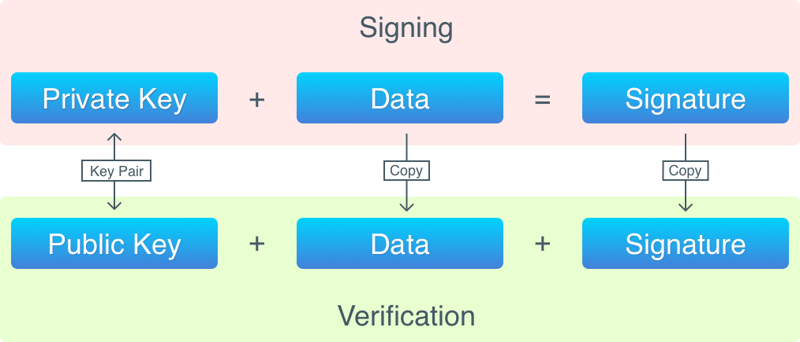

## Lập trình Blockchain với Golang. Part 5: Address 

>Bài dịch từ _Building Blockchain in Go_ của tác giả _Ivan Kuznetsov_. Khi sử dụng vui lòng trích dẫn nguồn [@hlongvu](https://github.com/hlongvu/blockchain-go-vietnamese)


### Mục lục

1. [Lập trình Blockchain với Golang. Part 1: Cơ bản](https://github.com/hlongvu/blockchain-go-vietnamese/blob/master/Blockchain-go-part1.md)
2. [Lập trình Blockchain với Golang. Part 2: Proof-of-work](https://github.com/hlongvu/blockchain-go-vietnamese/blob/master/Blockchain-go-part2.md)
3. [Lập trình Blockchain với Golang. Part 3: Lưu trữ và tương tác CLI](https://github.com/hlongvu/blockchain-go-vietnamese/blob/master/Blockchain-go-part3.md)
4. [Lập trình Blockchain với Golang. Part 4: Transactions 1](https://github.com/hlongvu/blockchain-go-vietnamese/blob/master/Blockchain-go-part4.md)
5. [Lập trình Blockchain với Golang. Part 5: Address](https://github.com/hlongvu/blockchain-go-vietnamese/blob/master/Blockchain-go-part5.md) 
6. [Lập trình Blockchain với Golang. Part 6: Transaction 2](https://github.com/hlongvu/blockchain-go-vietnamese/blob/master/Blockchain-go-part6.md)
7. [Lập trình Blockchain với Golang. Part 7: Network](https://github.com/hlongvu/blockchain-go-vietnamese/blob/master/Blockchain-go-part7.md)

### Giới thiệu

Trong phần trước chúng ta đã xây dựng được transaction. Các bạn cũng đã được giới thiệu về tính ẩn danh của transaction: không có user account, thông tin cá nhân không hề được lưu trữ trên hệ thống Bitcoin. Nhưng vậy phải có thứ gì đó chứng minh bạn là chủ sở hữu của những transaction chưa sử dụng này. Đây là nhiệm vụ mà address trong Bitcoin đảm nhiệm. Ở phần code trước chúng ta đã dùng string làm username để làm khoá trong các UTXO. Bây giờ chúng ta sẽ tiến hành xây dựng các address thật, tương tự như trong Bitcoin.

> Hàm lượng code thay đổi là rất lớn nên các bạn có thể theo dõi tất cả ở [đây](https://github.com/Jeiwan/blockchain_go/compare/part_4...part_5#files_bucket)


### Bitcoin Address

Đây là một ví dụ của Bitcoin address: [1A1zP1eP5QGefi2DMPTfTL5SLmv7DivfNa](https://blockchain.info/address/1A1zP1eP5QGefi2DMPTfTL5SLmv7DivfNa). Đây là địa chỉ đầu tiên của Bitcoin, thuộc về Satoshi Nakamoto. Địa chỉ Bitcoin luôn luôn công khai. Nếu bạn muốn gửi coins cho bất kì ai, bạn phải biết địa chỉ của người đó. Nhưng việc có địa chỉ không chứng minh bạn là chủ của "ví" (wallet) đó. Address thực ra là thể hiện string của public key. Trong Bitcoin, định danh là một cặp private, public key lưu trong máy tính (hoặc một nơi nào đó bạn có quyền truy cập). Bitcoin dựa vào các tổ hợp của các thuật toán mã hoá để tạo nên các keys này, và đảm bảo rằng không ai khác có thể sử dụng coin của bạn mà khi không biết keys của bạn. Hãy xem các thuật toán đó là gì.

### Public-key Cryptography
Public-key Cryptography (mã hoá công khai) sử dụng một cặp keys: public key và private key. Public key thì không cần bảo mật và có thể cho bất kì ai biết. Ngược lại, private key thì cần phải bảo mật, không ai ngoài chủ sở hữu được biết vì private key có tác dụng như chìa khoá.

Về bản chất, ví Bitcoin là một cặp key đó. Khi bạn sử dụng một app wallet hoặc dùng một Bitcoin client để tạo address, một cặp key sẽ được tạo ra cho bạn. Bất kì ai nắm private key đều có quyền sử dụng tất cả coins được gửi tới key này trong Bitcoin.


Private key và Public key đều chỉ là các mảng bytes ngẫu nhiên, nên không thể in ra trên màn hình một cách dễ đọc. Vì thế Bitcoin sử dụng một thuật toán để chuyển đổi public key sang dạng string dễ đọc hơn.

> Nếu bạn từng sử dụng Bitcoin wallet, bạn có thể thấy chương trình thường đưa cho bạn một chuỗi các pass phrase (gồm 12 hoặc 24 từ tiếng Anh). Pass phrase đó được dùng thay cho private key và có thể tạo ra private key. Cơ chế này được xây dựng ở [BIP-039](https://github.com/bitcoin/bips/blob/master/bip-0039.mediawiki). 

> BIP: Bitcoin Improvement Proposal

Chúng ta biết key định danh user trong Bitcoin. Vậy làm cách nào Bitcoin kiểm tra sở hữu của các outputs chưa sử dụng UTXO?

### Digital Signature - Chữ Ký Số

Trong toán học và mã hoá, có một khái niệm về chữ ký số (digital signature) có thể đảm bảo các tính chất sau:

1. Đảm bảo dữ liệu không bị sửa chữa khi được gửi từ người này tới người kia
2. Xác minh được dữ liệu được tạo bởi 1 người xác định
3. Đảm bảo được việc một người gửi dữ liệu đi không phủ nhận được đó không phải của mình


Bằng cách áp dụng chữ ký số lên dữ liệu (Signing), chúng ta được một chữ ký, mà sau đó có thể xác thực được. Signing bằng cách sử dụng private key, và xác minh chỉ cần public key.

Để sign dữ liệu chúng ta cần:

1. Dữ liệu để sign
2. Private key

Để xác minh một chữ ký (được lưu trong các transaction input), chúng ta cần:

1. Dữ liệu đã được sign
2. Chữ ký (signature)
3. Public key

Nói ngắn gọn thì việc xác minh chữ ký là: kiểm tra xem chữ ký này có đúng với dữ liệu và private key tương ứng với public key này không.

> Chữ ký số không phải là mã hoá dữ liệu, chúng ta không thể tái tạo lại dữ liệu ban đầu từ chữ ký. Tương tự như hàm băm, dữ liệu chạy qua một hàm băm để cho ra một biểu diễn độc nhất tương ứng. Sự khác nhau giữa chữ ký và hash đó là cặp keys, chúng giúp việc xác minh chữ ký mà không lộ private key.
> 
> Cặp keys thực ra cũng có thể dùng để mã hoá dữ liệu. Public key dùng để mã hoá và private key dùng để giải mã. Nhưng Bitcoin không sử dụng tính năng này.


Các transaction input trong Bitcoin được sign bởi người tạo transaction. Tất cả các transaction đều phải được xác minh trước khi cho vào block. Xác minh bao gồm:

1. Kiểm tra các input có quyền sử dụng các output trong các transactions nó trỏ tới.
2. Kiểm tra transaction signature là đúng

Quá trình này về cơ bản như sau:



Bây giờ hãy xem lại vòng đời của một transaction: 

1. Lúc khởi tạo, blockchain chỉ có một genesis block chứa coinbase transaction. Trong coinbase transaction này không có input nên không cần việc signing. Output của coinbase transaction chứa hash của một public key. (RIPEMD16(SHA256(PubKey) thuật toán này được sử dụng để tính hash của public key).

2. Khi một người gửi coin, một transaction được khởi tạo. Các input của transaction này phải trỏ tới các outputs của transaction đã có. Mỗi input sẽ chứa một public key (không hash) và một chữ ký của cả transaction.

3. Những người khác trong mạng Bitcoin (node) khi nhận được transaction trên sẽ phải xác minh nó. Nó phải 1. kiểm tra hash của public key trong input giống với hash của output mà nó trỏ tới; 2. kiểm tra chữ ký của transaction.

4. Khi miner sẵn sàng mine block mới, nó sẽ cho transaction này vào block và khởi động việc mining.

5. Khi block được mine xong, tất cả các node khác trong mạng sẽ nhận được message thông báo có block mới và thêm block này vào blockchain.

6. Sau khi block được thêm vào blockchain, transaction này đã hoàn thành. Các outputs trong transaction này đã có thể được dùng trong transaction mới trong tương lai.

### Elliptic Curve Cryptography

Như đã đề cập ở trên, public và private key là các chuỗi bytes ngẫu nhiên. Bởi private key được dùng để quyết định quyền sở hữu coin nên có một điều kiện phải thoả mãn: thuật toán random để sinh ra key phải thật chuẩn xác. Chúng ta hoàn toàn không muốn ngẫu nhiên tạo ra một private key trùng với một người khác.

Bitcoin sử dụng mã hoá Elliptic Curve để tạo private key. Elliptic Curve là một mô hình toán học phức tạp, chúng ta không giải thích ở đây ( nếu bạn tò mò muốn biết có thể xem tại [đây](http://andrea.corbellini.name/2015/05/17/elliptic-curve-cryptography-a-gentle-introduction/) ). Bạn chỉ cần biết là mô hình toán học này có thể dùng để tạo ra các số rất lớn và ngẫu nhiên. Ở Bitcoin có thể tạo ra số trong khoảng 0 đến 2²⁵⁶ ( gần bằng 10⁷⁷, trong khi đó chỉ có 10⁷⁸ đến 10⁸² nguyên tử trong vũ trụ). Đó là một con số rất lớn có thể đảm bảo không bao giờ random ra hai private key giống nhau.

Ngoài ra, Bitcoin dùng ECDSA (Elliptic Curve Digital Signature Algorithm) để sign các transaction. Chúng ta cũng sẽ sử dụng thuật toán này.


### Base58
Hãy quay lại ví dụ về địa chỉ Bitcoin trước: 1A1zP1eP5QGefi2DMPTfTL5SLmv7DivfNa. Đây là dạng string đơn giản có thể đọc được của public key. Nếu giải mã nó thì chúng ta sẽ được chuỗi sau (mảng byte viết dưới hệ 16):

```
0062E907B15CBF27D5425399EBF6F0FB50EBB88F18C29B7D93
```

Bitcoin sử dụng mã hoá Base58 để chuyển public key sang dạng dễ đọc (address). Thuật toán này rất giống với Base64, nhưng bỏ bớt một số chữ cái nhằm tránh việc đọc nhầm lẫn dễ gây lỗi. Do đó, Base58 không có các chữ sau: 0 (zero), O (capital o), I (capital i), l (lowercase L) . Ngoài ra không có + và /.

Dưới đây là tiến trình chuyển public key sang address:


Vậy một address của Bitcoin sẽ có các phần sau:

```
Version  Public key hash                           Checksum
00       62E907B15CBF27D5425399EBF6F0FB50EBB88F18  C29B7D93
```

Thuật toán hash là một chiều, chúng ta không thể lấy lại public key chỉ dựa vào hash. Nhưng chúng ta có thể kiểm tra một public key có tạo ra hash đúng thế không (bằng cách chạy lại hàm trên và so sánh).

Đi sâu vào code chúng ta sẽ thấy các khái niệm trên dễ hiểu hơn.

### Cài đặt Addresses

Chúng ta bắt đầu với Wallet:

```
type Wallet struct {
	PrivateKey ecdsa.PrivateKey
	PublicKey  []byte
}

type Wallets struct {
	Wallets map[string]*Wallet
}

func NewWallet() *Wallet {
	private, public := newKeyPair()
	wallet := Wallet{private, public}

	return &wallet
}

func newKeyPair() (ecdsa.PrivateKey, []byte) {
	curve := elliptic.P256()
	private, err := ecdsa.GenerateKey(curve, rand.Reader)
	pubKey := append(private.PublicKey.X.Bytes(), private.PublicKey.Y.Bytes()...)

	return *private, pubKey
}
```

Một ví (wallet) không có gì hơn ngoài một cặp key. Vậy nên chúng ta cần thêm **Wallets**, gồm một list các wallet, lưu lại được vào file và đọc lại. Hàm **newKeyPair** được dùng để tạo một cặp key mới: Chúng ta khởi tạo một ECDSA và tạo một private key, public key được tạo ra từ private key này. Chú ý: Trong thuật toán eliptic curve, public key là các điểm trên đường cong đồ thị. Do đó public key là tổ hợp của các toạ độ X, Y. Trong Bitcoin, các toạ độ này được ghép lại với nhau tạo thành public key.

Bây giờ hãy tạo address:

```
func (w Wallet) GetAddress() []byte {
	pubKeyHash := HashPubKey(w.PublicKey)

	versionedPayload := append([]byte{version}, pubKeyHash...)
	checksum := checksum(versionedPayload)

	fullPayload := append(versionedPayload, checksum...)
	address := Base58Encode(fullPayload)

	return address
}

func HashPubKey(pubKey []byte) []byte {
	publicSHA256 := sha256.Sum256(pubKey)

	RIPEMD160Hasher := ripemd160.New()
	_, err := RIPEMD160Hasher.Write(publicSHA256[:])
	publicRIPEMD160 := RIPEMD160Hasher.Sum(nil)

	return publicRIPEMD160
}

func checksum(payload []byte) []byte {
	firstSHA := sha256.Sum256(payload)
	secondSHA := sha256.Sum256(firstSHA[:])

	return secondSHA[:addressChecksumLen]
}

```

Các bước để tạo address từ public key như sau:

1. Lấy public key và hash nó với thuật toán **RIPEMD160(SHA256(PubKey))**
2. Thêm các byte version vào đầu hash trên
3. Tính checksum bằng cách hash tiếp **SHA256(SHA256(payload))**. Lấy 4 bytes từ hash này.
4. Ghép checksum vào hash ở bước 2 **version+PubKeyHash**
5. Mã hoá lại **version+PubKeyHash+checksum** theo Base58

Kết quả là chúng ta sẽ được một **địa chỉ Bitcoin thật**, bạn có thể kiểm tra balance của địa chỉ này tại [blockchain.info](https://blockchain.info/). Tôi có thể dám chắc balance này luôn bằng 0 cho dù bạn thử bao nhiêu lần. Đây là lí do tại sao chúng ta cần chọn một thuật toán mã hoá tốt: Thử hình dung việc sinh private key, phải đảm bảo cơ hội sinh ra trùng private key là cực kì thấp. Một cách lí tưởng thì phải là "không bao giờ".

Cũng chú ý là bạn không cần phải kết nối tới một máy tính chạy mạng Bitcoin để tạo được một address. Thuật toán tạo address này là chung và công khai, không phụ thuộc vào tính và ngôn ngữ sử dụng.

Chúng ta phải cập nhật lại input và output trong transaction để sử dụng address:

```
type TXInput struct {
	Txid      []byte
	Vout      int
	Signature []byte
	PubKey    []byte
}

func (in *TXInput) UsesKey(pubKeyHash []byte) bool {
	lockingHash := HashPubKey(in.PubKey)

	return bytes.Compare(lockingHash, pubKeyHash) == 0
}

type TXOutput struct {
	Value      int
	PubKeyHash []byte
}

func (out *TXOutput) Lock(address []byte) {
	pubKeyHash := Base58Decode(address)
	pubKeyHash = pubKeyHash[1 : len(pubKeyHash)-4]
	out.PubKeyHash = pubKeyHash
}

func (out *TXOutput) IsLockedWithKey(pubKeyHash []byte) bool {
	return bytes.Compare(out.PubKeyHash, pubKeyHash) == 0
}
```

Chú ý là chúng ta không còn sử dụng **ScriptPubKey** và **ScriptSig** vì chúng ta sẽ không xây dựng một ngôn ngữ Script như Bitcoin. Thay vào đó **ScriptSig** chia thành **Signature** và **PubKey** còn **ScriptPubKey** đổi tên thành **PubKeyHash**. Chúng ta sẽ xây dựng cơ chế khoá, mở khoá và chữ ký inputs như ở Bitcoin, nhưng đặt trong các hàm thay vì Script.

Hàm **UsesKey** kiểm tra xem input có sử dụng được key để mở khoá được không. Chú ý là trong input là public key chưa hash, còn hàm sử dụng một key đã hash. **IsLockedWithKey** kiểm tra xem key có dùng để mở khoá output này được không. Hàm này bổ sung cho **UsesKey**  và sẽ được dùng trong **FindUnspentTransactions** để kiểm tra liên kết giữa các transaction.

Hàm **Lock** dùng để khoá output. Khi chúng ta gửi coin cho ai đó, chúng ta chỉ biết địa chỉ của họ. Hàm này nhận tham số là địa chỉ đó. Địa chỉ được giải mã để lấy public key hash và lưu lại trong trường **out.PubKeyHash**.

Giờ hãy kiểm tra xem mọi thứ có hoạt động không:

```
$ blockchain_go createwallet
Your new address: 13Uu7B1vDP4ViXqHFsWtbraM3EfQ3UkWXt

$ blockchain_go createwallet
Your new address: 15pUhCbtrGh3JUx5iHnXjfpyHyTgawvG5h

$ blockchain_go createwallet
Your new address: 1Lhqun1E9zZZhodiTqxfPQBcwr1CVDV2sy

$ blockchain_go createblockchain -address 13Uu7B1vDP4ViXqHFsWtbraM3EfQ3UkWXt
0000005420fbfdafa00c093f56e033903ba43599fa7cd9df40458e373eee724d

Done!

$ blockchain_go getbalance -address 13Uu7B1vDP4ViXqHFsWtbraM3EfQ3UkWXt
Balance of '13Uu7B1vDP4ViXqHFsWtbraM3EfQ3UkWXt': 10

$ blockchain_go send -from 15pUhCbtrGh3JUx5iHnXjfpyHyTgawvG5h -to 13Uu7B1vDP4ViXqHFsWtbraM3EfQ3UkWXt -amount 5
2017/09/12 13:08:56 ERROR: Not enough funds

$ blockchain_go send -from 13Uu7B1vDP4ViXqHFsWtbraM3EfQ3UkWXt -to 15pUhCbtrGh3JUx5iHnXjfpyHyTgawvG5h -amount 6
00000019afa909094193f64ca06e9039849709f5948fbac56cae7b1b8f0ff162

Success!

$ blockchain_go getbalance -address 13Uu7B1vDP4ViXqHFsWtbraM3EfQ3UkWXt
Balance of '13Uu7B1vDP4ViXqHFsWtbraM3EfQ3UkWXt': 4

$ blockchain_go getbalance -address 15pUhCbtrGh3JUx5iHnXjfpyHyTgawvG5h
Balance of '15pUhCbtrGh3JUx5iHnXjfpyHyTgawvG5h': 6

$ blockchain_go getbalance -address 1Lhqun1E9zZZhodiTqxfPQBcwr1CVDV2sy
Balance of '1Lhqun1E9zZZhodiTqxfPQBcwr1CVDV2sy': 0

```

Tiếp theo chúng ta sẽ cài đặt phần chữ ký transaction.

### Cài Đặt Signatures

Transaction phải được sign vì đây là cách duy nhất Bitcoin đảm bảo việc một người không thể dùng coin của người khác. Nếu chữ ký (signature) là sai, cả transaction cũng được coi là vô hiệu và không được cho vào blockchain.

Chúng ta đã có các thành phần để tạo signature cho transaction, trừ phần dữ liệu. Phần nào của transaction cần được sign? Hay phải sign toàn bộ transaction? Chọn lựa dữ liệu để sign cũng khá quan trọng. Vấn đề là phải chọn lựa dữ liệu chứa các thông tin đủ và cần thiết. Ví dụ, sẽ vô lí khi chỉ sign các output vì chưa đủ để bảo vệ người gửi và người nhận.

Các transaction phải mở khoá các output, tính toán lượng coin cần gửi, khoá lại trong output mới. Những dữ liệu cần sign bao gồm:

1. Public key của các output cần mở khoá. Đây là phần thể hiện "người gửi" của transaction
2. Public key hash của output bị khoá. Đây là phần thể hiện "người nhận" của transaction
3. Value của output mới (giá trị coin sẽ gửi đi)

> Trong Bitcoin, logic khoá và mở khoá được lưu trong các đoạn mã, nằm ở **ScriptSig** và **ScriptPubKey**. Bitcoin sẽ sign cả đoạn mã **ScriptPubKey**.

Như bạn thấy, chúng ta không cần sign các public key trong các input. Vì thế nên trong Bitcoin, không phải transaction được sign mà chỉ là một phần của nó với input chứa **ScriptPubKey**.

> Chi tiết của tiến trình lấy một phần transaction để sign được mô tả tại [đây](https://en.bitcoin.it/wiki/File:Bitcoin_OpCheckSig_InDetail.png). Có thể nó là bản cũ, nhưng tôi chưa tìm được một mô tả nào khác tin cậy hơn.

Có vẻ khá loằng ngoằng, nhưng hãy bắt đầu code hàm **Sign**:

```
func (tx *Transaction) Sign(privKey ecdsa.PrivateKey, prevTXs map[string]Transaction) {
	if tx.IsCoinbase() {
		return
	}

	txCopy := tx.TrimmedCopy()

	for inID, vin := range txCopy.Vin {
		prevTx := prevTXs[hex.EncodeToString(vin.Txid)]
		txCopy.Vin[inID].Signature = nil
		txCopy.Vin[inID].PubKey = prevTx.Vout[vin.Vout].PubKeyHash
		txCopy.ID = txCopy.Hash()
		txCopy.Vin[inID].PubKey = nil

		r, s, err := ecdsa.Sign(rand.Reader, &privKey, txCopy.ID)
		signature := append(r.Bytes(), s.Bytes()...)

		tx.Vin[inID].Signature = signature
	}
}
```

Hàm này lấy private key và một map của các transaction trước. Như đã nhắc ở trước, để sign một transaction chúng ta cần các output được trỏ tới bởi các input của transaction này, cho nên chúng ta cần các transaction lưu giữ các output này (prevTXs).

Hãy xem lại các bước:

```
if tx.IsCoinbase() {
	return
}
```

Coinbase transaction không cần sign vì nó không có input.

```
txCopy := tx.TrimmedCopy()

```

Một phần của transaction được sao chép lại để sign, không phải toàn bộ:

```
func (tx *Transaction) TrimmedCopy() Transaction {
	var inputs []TXInput
	var outputs []TXOutput

	for _, vin := range tx.Vin {
		inputs = append(inputs, TXInput{vin.Txid, vin.Vout, nil, nil})
	}

	for _, vout := range tx.Vout {
		outputs = append(outputs, TXOutput{vout.Value, vout.PubKeyHash})
	}

	txCopy := Transaction{tx.ID, inputs, outputs}

	return txCopy
}

```

Phiên bản sao chép này chứa toàn bộ input và output nhưng **TXInput.Signature** và **TXInput.PubKey**
được chuyển thành nil.

Sau đó chúng ta quét qua mảng input:

```
for inID, vin := range txCopy.Vin {
	prevTx := prevTXs[hex.EncodeToString(vin.Txid)]
	txCopy.Vin[inID].Signature = nil
	txCopy.Vin[inID].PubKey = prevTx.Vout[vin.Vout].PubKeyHash
	
```

Tại mỗi input, **Signature** được đặt lại nil (double-check) and **PubKey** được đặt thành **PubKeyHash** của output được trỏ tới. **Các input được sign riêng rẽ nhau**, blockchain của chúng ta không cần điều này, tuy nhiên ở Bitcoin thì các input có thể trỏ tới các address khác nhau.

```
txCopy.ID = txCopy.Hash()
txCopy.Vin[inID].PubKey = nil

```

Hàm **Hash** serialize transaction và lấy hash theo thuật toán SHA-256. Chúng ta sẽ lấy hash này để sign. Sau khi lấy hash chúng ta trả lại giá trị cho **PubKey** để không ảnh hưởng tới vòng lặp khác.

Đây là phần chính:

```
r, s, err := ecdsa.Sign(rand.Reader, &privKey, txCopy.ID)
signature := append(r.Bytes(), s.Bytes()...)
tx.Vin[inID].Signature = signature

```
Chúng ta sign **txCopy.ID** bằng **privKey**. Một chữ ký ECDSA là một cặp số, được gộp lại và lưu vào   **input.Signature**.

Tiếp theo là hàm để xác minh signature:

```
func (tx *Transaction) Verify(prevTXs map[string]Transaction) bool {
	txCopy := tx.TrimmedCopy()
	curve := elliptic.P256()

	for inID, vin := range tx.Vin {
		prevTx := prevTXs[hex.EncodeToString(vin.Txid)]
		txCopy.Vin[inID].Signature = nil
		txCopy.Vin[inID].PubKey = prevTx.Vout[vin.Vout].PubKeyHash
		txCopy.ID = txCopy.Hash()
		txCopy.Vin[inID].PubKey = nil

		r := big.Int{}
		s := big.Int{}
		sigLen := len(vin.Signature)
		r.SetBytes(vin.Signature[:(sigLen / 2)])
		s.SetBytes(vin.Signature[(sigLen / 2):])

		x := big.Int{}
		y := big.Int{}
		keyLen := len(vin.PubKey)
		x.SetBytes(vin.PubKey[:(keyLen / 2)])
		y.SetBytes(vin.PubKey[(keyLen / 2):])

		rawPubKey := ecdsa.PublicKey{curve, &x, &y}
		if ecdsa.Verify(&rawPubKey, txCopy.ID, &r, &s) == false {
			return false
		}
	}

	return true
}
```

Tương tự như phần sign, chúng ta cần sao chép một phần của transaction:

```
txCopy := tx.TrimmedCopy()
```

Khởi tạo thuật toán mã hoá:

```
curve := elliptic.P256()

```

Sau đó chúng ta kiểm tra signature ở mỗi input:

```
for inID, vin := range tx.Vin {
	prevTx := prevTXs[hex.EncodeToString(vin.Txid)]
	txCopy.Vin[inID].Signature = nil
	txCopy.Vin[inID].PubKey = prevTx.Vout[vin.Vout].PubKeyHash
	txCopy.ID = txCopy.Hash()
	txCopy.Vin[inID].PubKey = nil
```

Phần này tương tự với hàm **Sign**, xác minh cũng cần dữ liệu giống với lúc tạo chữ ký:

```
r := big.Int{}
	s := big.Int{}
	sigLen := len(vin.Signature)
	r.SetBytes(vin.Signature[:(sigLen / 2)])
	s.SetBytes(vin.Signature[(sigLen / 2):])

	x := big.Int{}
	y := big.Int{}
	keyLen := len(vin.PubKey)
	x.SetBytes(vin.PubKey[:(keyLen / 2)])
	y.SetBytes(vin.PubKey[(keyLen / 2):])
```

Ở đây chúng ta tách **TXInput.Signature** và **TXInput.PubKey** thành hai phần tương ứng với 2 toạ độ của public key để sử dụng theo thư viện **crypto/ecdsa**.

```
	rawPubKey := ecdsa.PublicKey{curve, &x, &y}
	if ecdsa.Verify(&rawPubKey, txCopy.ID, &r, &s) == false {
		return false
	}
}

return true
```

Chúng ta khởi tạo lại **ecdsa.PublicKey** và chạy hàm **ecdsa.Verify**. Nếu tất cả các input đều đúng sẽ trả lại true, ngược lại có 1 input sai thì sẽ trả về false.


Bây giờ chúng ta cần có thêm hàm để tìm kiếm các transaction trước (tương ứng với các UTXO). Hàm này sẽ yêu cầu tham chiếu tới blockchain, vì thế nó được đặt làm hàm con của Blockchain:

```
func (bc *Blockchain) FindTransaction(ID []byte) (Transaction, error) {
	bci := bc.Iterator()

	for {
		block := bci.Next()

		for _, tx := range block.Transactions {
			if bytes.Compare(tx.ID, ID) == 0 {
				return *tx, nil
			}
		}

		if len(block.PrevBlockHash) == 0 {
			break
		}
	}

	return Transaction{}, errors.New("Transaction is not found")
}

func (bc *Blockchain) SignTransaction(tx *Transaction, privKey ecdsa.PrivateKey) {
	prevTXs := make(map[string]Transaction)

	for _, vin := range tx.Vin {
		prevTX, err := bc.FindTransaction(vin.Txid)
		prevTXs[hex.EncodeToString(prevTX.ID)] = prevTX
	}

	tx.Sign(privKey, prevTXs)
}

func (bc *Blockchain) VerifyTransaction(tx *Transaction) bool {
	prevTXs := make(map[string]Transaction)

	for _, vin := range tx.Vin {
		prevTX, err := bc.FindTransaction(vin.Txid)
		prevTXs[hex.EncodeToString(prevTX.ID)] = prevTX
	}

	return tx.Verify(prevTXs)
}
```

Nội dung của các hàm này khá đơn giản: **FindTransaction** tìm kiếm các transaction theo ID; **SignTransaction** lấy một transaction, tìm kiếm các transaction liên quan và sign; **VerifyTransaction** tương tự, nhưng là xác minh.

Việc sign các transaction diễn ra ở **NewUTXOTransaction**:

```
func NewUTXOTransaction(from, to string, amount int, bc *Blockchain) *Transaction {
	...

	tx := Transaction{nil, inputs, outputs}
	tx.ID = tx.Hash()
	bc.SignTransaction(&tx, wallet.PrivateKey)

	return &tx
}
```

Còn xác minh các transaction diễn ra trước khi các transaction được cho vào block:

```
func (bc *Blockchain) MineBlock(transactions []*Transaction) {
	var lastHash []byte

	for _, tx := range transactions {
		if bc.VerifyTransaction(tx) != true {
			log.Panic("ERROR: Invalid transaction")
		}
	}
	...
}
```

Xong, hãy kiểm tra lại chương trình một lần nữa:

```
$ blockchain_go createwallet
Your new address: 1AmVdDvvQ977oVCpUqz7zAPUEiXKrX5avR

$ blockchain_go createwallet
Your new address: 1NE86r4Esjf53EL7fR86CsfTZpNN42Sfab

$ blockchain_go createblockchain -address 1AmVdDvvQ977oVCpUqz7zAPUEiXKrX5avR
000000122348da06c19e5c513710340f4c307d884385da948a205655c6a9d008

Done!

$ blockchain_go send -from 1AmVdDvvQ977oVCpUqz7zAPUEiXKrX5avR -to 1NE86r4Esjf53EL7fR86CsfTZpNN42Sfab -amount 6
0000000f3dbb0ab6d56c4e4b9f7479afe8d5a5dad4d2a8823345a1a16cf3347b

Success!

$ blockchain_go getbalance -address 1AmVdDvvQ977oVCpUqz7zAPUEiXKrX5avR
Balance of '1AmVdDvvQ977oVCpUqz7zAPUEiXKrX5avR': 4

$ blockchain_go getbalance -address 1NE86r4Esjf53EL7fR86CsfTZpNN42Sfab
Balance of '1NE86r4Esjf53EL7fR86CsfTZpNN42Sfab': 6
```

Hãy comment lại phần **bc.SignTransaction(&tx, wallet.PrivateKey)** để xem các transaction chưa sign có được sign hay không:

```
func NewUTXOTransaction(from, to string, amount int, bc *Blockchain) *Transaction {
   ...
	tx := Transaction{nil, inputs, outputs}
	tx.ID = tx.Hash()
	// bc.SignTransaction(&tx, wallet.PrivateKey)

	return &tx
}
```

```
$ go install
$ blockchain_go send -from 1AmVdDvvQ977oVCpUqz7zAPUEiXKrX5avR -to 1NE86r4Esjf53EL7fR86CsfTZpNN42Sfab -amount 1
2017/09/12 16:28:15 ERROR: Invalid transaction
```

Awesome!

### Kết luận
Chúng ta đã cài đặt được khá nhiều chức năng của Bitcoin lên blockchain này, trừ các phần liên quan tới network. Trong phần tới chúng ta sẽ hoàn thiện các tính năng của transaction.

### Links

1. [Full source codes](https://github.com/Jeiwan/blockchain_go/tree/part_5)
2. [Public-key cryptography](https://en.wikipedia.org/wiki/Public-key_cryptography)
3. [Digital signatures](https://en.wikipedia.org/wiki/Digital_signature)
4. [Elliptic curve](https://en.wikipedia.org/wiki/Elliptic_curve)
5. [Elliptic curve cryptography](https://en.wikipedia.org/wiki/Elliptic_curve_cryptography)
6. [ECDSA](https://en.wikipedia.org/wiki/Elliptic_Curve_Digital_Signature_Algorithm)
7. [Technical background of Bitcoin addresses](https://en.bitcoin.it/wiki/Technical_background_of_version_1_Bitcoin_addresses)
8. [Address](https://en.bitcoin.it/wiki/Address)
9. [Base58](https://en.bitcoin.it/wiki/Base58Check_encoding)
10. [A gentle introduction to elliptic curve cryptography](http://andrea.corbellini.name/2015/05/17/elliptic-curve-cryptography-a-gentle-introduction/)


### Mục lục

1. [Lập trình Blockchain với Golang. Part 1: Cơ bản](https://github.com/hlongvu/blockchain-go-vietnamese/blob/master/Blockchain-go-part1.md)
2. [Lập trình Blockchain với Golang. Part 2: Proof-of-work](https://github.com/hlongvu/blockchain-go-vietnamese/blob/master/Blockchain-go-part2.md)
3. [Lập trình Blockchain với Golang. Part 3: Lưu trữ và tương tác CLI](https://github.com/hlongvu/blockchain-go-vietnamese/blob/master/Blockchain-go-part3.md)
4. [Lập trình Blockchain với Golang. Part 4: Transactions 1](https://github.com/hlongvu/blockchain-go-vietnamese/blob/master/Blockchain-go-part4.md)
5. [Lập trình Blockchain với Golang. Part 5: Address](https://github.com/hlongvu/blockchain-go-vietnamese/blob/master/Blockchain-go-part5.md) 
6. [Lập trình Blockchain với Golang. Part 6: Transaction 2](https://github.com/hlongvu/blockchain-go-vietnamese/blob/master/Blockchain-go-part6.md)
7. [Lập trình Blockchain với Golang. Part 7: Network](https://github.com/hlongvu/blockchain-go-vietnamese/blob/master/Blockchain-go-part7.md)
