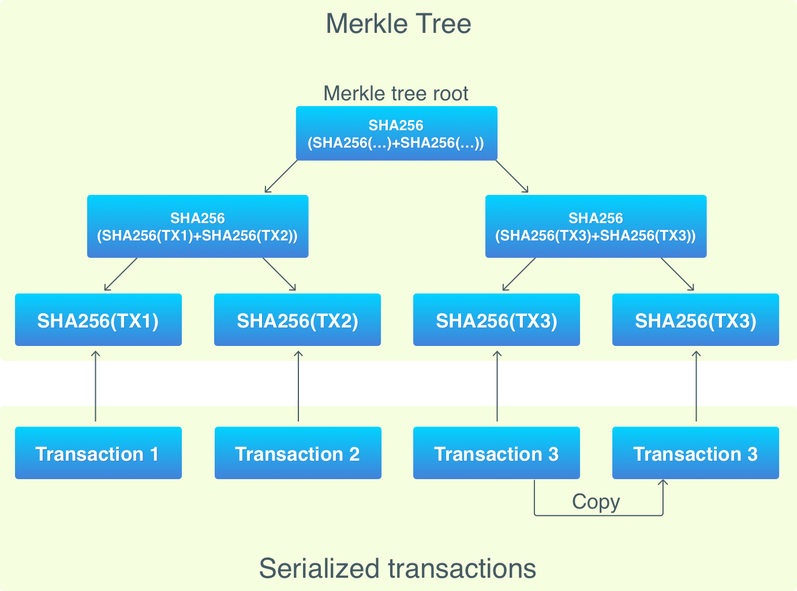

## Lập trình Blockchain với Golang. Part 6: Transaction 2

>Bài dịch từ _Building Blockchain in Go_ của tác giả _Ivan Kuznetsov_. Khi sử dụng vui lòng trích dẫn nguồn [@hlongvu](https://github.com/hlongvu/blockchain-go-vietnamese)


### Mục lục

1. [Lập trình Blockchain với Golang. Part 1: Cơ bản](https://github.com/hlongvu/blockchain-go-vietnamese/blob/master/Blockchain-go-part1.md)
2. [Lập trình Blockchain với Golang. Part 2: Proof-of-work](https://github.com/hlongvu/blockchain-go-vietnamese/blob/master/Blockchain-go-part2.md)
3. [Lập trình Blockchain với Golang. Part 3: Lưu trữ và tương tác CLI](https://github.com/hlongvu/blockchain-go-vietnamese/blob/master/Blockchain-go-part3.md)
4. [Lập trình Blockchain với Golang. Part 4: Transactions 1](https://github.com/hlongvu/blockchain-go-vietnamese/blob/master/Blockchain-go-part4.md)
5. [Lập trình Blockchain với Golang. Part 5: Address](https://github.com/hlongvu/blockchain-go-vietnamese/blob/master/Blockchain-go-part5.md) 
6. [Lập trình Blockchain với Golang. Part 6: Transaction 2](https://github.com/hlongvu/blockchain-go-vietnamese/blob/master/Blockchain-go-part6.md)
7. [Lập trình Blockchain với Golang. Part 7: Network](https://github.com/hlongvu/blockchain-go-vietnamese/blob/master/Blockchain-go-part7.md)

### Giới thiệu

Trong những phần trước, chúng ta đã nói về blockchain là một bộ cơ sở dữ liệu phân tán, tuy nhiên chỉ mới xây dựng phần dữ liệu chứ chưa có phân tán. Phần này chúng ta sẽ tiếp tục bổ sung các cơ chế của transaction còn thiếu, tiếp tục trong phần sau sẽ đi vào tính phân tán của blockchain.


> Hàm lượng code thay đổi là rất lớn nên các bạn có thể theo dõi tất cả ở [đây](https://github.com/Jeiwan/blockchain_go/compare/part_5...part_6#files_bucket)


### Reward - Phần thưởng

Một tính năng nhỏ chúng ta bỏ qua trong phần trước đó là reward cho việc mining. Tới lúc này thì chúng ta đã có đủ các yếu tố để cài đặt nó.

Reward đơn giản chỉ là một coinbase transaction. Khi một node tham gia đào block mới, nó gom các transaction đang chờ và thêm vào 1 coinbase transaction. Coinbase transaction này chỉ có một output chứa public key hash của người đào (- tự thưởng cho mình).

Cài đặt reward khá dễ bằng cách cập nhật hàm send:

```
func (cli *CLI) send(from, to string, amount int) {
    ...
    bc := NewBlockchain()
    UTXOSet := UTXOSet{bc}
    defer bc.db.Close()

    tx := NewUTXOTransaction(from, to, amount, &UTXOSet)
    cbTx := NewCoinbaseTX(from, "")
    txs := []*Transaction{cbTx, tx}

    newBlock := bc.MineBlock(txs)
    fmt.Println("Success!")
}
```

Trong blockchain của chúng ta, người tạo transaction cũng đào luôn block và nhận thưởng.

### UTXO Set

Trong [phần 3]() chúng ta đã biết cách Bitcoin Core lưu trữ block trong database. Các block được lưu trong tập dữ liệu **blocks** và các transaction output được lưu trong **chainstate**. Hãy xem lại lần nữa:

1. 'c' + 32-byte transaction hash -> unspent transaction output record for that transaction (*Lưu các unspent transaction output cho transaction id đó*)
2. 'B' -> 32-byte block hash: the block hash up to which the database represents the unspent transaction outputs (block cuối)

Blockchain của chúng ta đã có bucket **blocks** lưu các block tuy nhiên chưa có **chainstate**. Giờ chúng ta sẽ xây dựng phần này.

**chainstate** không lưu giữ các transaction. Thay vào đó nó lưu trữ UTXO Set, là tập hợp của các transaction output chưa sử dụng (unspent transaction output). Ngoài ra khoá 'B' như trong Bitcoin chúng ta cũng chưa cần cài đặt vì blockchain của chúng ta chưa có tham số block-height (độ cao block).

Vậy tại sao lại cần UTXO Set?

Hãy xem lại hàm **Blockchain.FindUnspentTransactions** đã cài đặt:

```
func (bc *Blockchain) FindUnspentTransactions(pubKeyHash []byte) []Transaction {
    ...
    bci := bc.Iterator()

    for {
        block := bci.Next()

        for _, tx := range block.Transactions {
            ...
        }

        if len(block.PrevBlockHash) == 0 {
            break
        }
    }
    ...
}
```

Hàm này tìm kiếm các utxo. Tuy nhiên do transaction được lưu trong block, chúng ta phải quét qua toàn bộ blockchain và kiểm tra mọi transaction trong nó. Tính tới 18/9/2017, Bitcoin có tới 485,860 block và toàn bộ dữ liệu lớn tới 140+ Gb. Như vậy khối lượng tính toán là rất lớn.

Giải pháp cho vấn đề này là lưu trữ riêng lại các utxo, và đây chính là việc mà UTXO Set đảm nhiệm. Nó là bộ nhớ đệm xây dựng từ blockchain (phải quét lại từ đầu, nhưng chỉ phải làm 1 lần), sau đó được dùng để tính toán balance và xác minh transaction mới. UTXO Set này rơi vào khoảng 2.7Gb vào 9/2017.

Hãy xem chúng ta cần thay đổi gì để cài đặt UTXO Set này. Hiện tại các hàm này được sử dụng để tìm kiếm các transaction:

1. **Blockchain.FindUnspentTransactions** - hàm chính để tìm các transaction chứa utxo. Nó quét qua toàn bộ block.
2. **Blockchain.FindSpendableOutputs** - hàm này sử dụng khi một transaction mới được tạo. Nó sẽ tìm đủ utxo phù hợp với số coin cần gửi. 
3. **Blockchain.FindUTXO** - tìm kiếm utxo cho một public key hash, dùng để tính balance.
4. **Blockchain.FindTransaction** - tìm kiếm các transaction trong blockchain bằng id. Nó quét qua tất cả block cho tới lúc tìm thấy.

Như chúng ta thấy các hàm trên đều phải quét qua toàn bộ blockchain. Bộ UTXO Set chỉ lưu các utxo nên sẽ không dùng được cho hàm **Blockchain.FindTransaction**

Vậy chúng ta cần các hàm sau:

1. **Blockchain.FindUTXO** – Tìm kiếm các utxo bằng cách quét qua block
2. **UTXOSet.Reindex** — dùng **FindUTXO** để tìm các utxo và lưu vào database. Đây là caching.
3. **UTXOSet.FindSpendableOutputs** – tương tự như **Blockchain.FindSpendableOutputs**, nhưng sử dụng UTXO Set.
4. **UTXOSet.FindUTXO** – tương tự như **Blockchain.FindUTXO**, nhưng dùng UTXO Set.
5. **Blockchain.FindTransaction** không đổi.

Như vậy các hàm dùng nhiều sẽ sử dụng qua cache này. Hãy bắtd đầu cài đặt:

```
type UTXOSet struct {
    Blockchain *Blockchain
}
```

Chúng ta sử dụng cùng một file database, tuy nhiên sẽ lưu UTXO Set vào một bucket khác. UTXOSet sẽ truy cập chung DB với Blockchain.

```
func (u UTXOSet) Reindex() {
    db := u.Blockchain.db
    bucketName := []byte(utxoBucket)

    err := db.Update(func(tx *bolt.Tx) error {
        err := tx.DeleteBucket(bucketName)
        _, err = tx.CreateBucket(bucketName)
    })

    UTXO := u.Blockchain.FindUTXO()

    err = db.Update(func(tx *bolt.Tx) error {
        b := tx.Bucket(bucketName)

        for txID, outs := range UTXO {
            key, err := hex.DecodeString(txID)
            err = b.Put(key, outs.Serialize())
        }
    })
}
```

Đây là hàm khởi tạo UTXO Set. Đầu tiên sẽ xoá bucket nếu đã có, sau đó sẽ quét qua toàn bộ Blockchain để tìm utxo và lưu lại trong database.

**Blockchain.FindUTXO** gần tương tự với **Blockchain.FindUnspentTransactions**, nhưng giờ sẽ trả về một map của cặp **TransactionID** → **TransactionOutputs**.

Bây giờ UTXO Set có thể dùng để send coin:

```
func (u UTXOSet) FindSpendableOutputs(pubkeyHash []byte, amount int) (int, map[string][]int) {
    unspentOutputs := make(map[string][]int)
    accumulated := 0
    db := u.Blockchain.db

    err := db.View(func(tx *bolt.Tx) error {
        b := tx.Bucket([]byte(utxoBucket))
        c := b.Cursor()

        for k, v := c.First(); k != nil; k, v = c.Next() {
            txID := hex.EncodeToString(k)
            outs := DeserializeOutputs(v)

            for outIdx, out := range outs.Outputs {
                if out.IsLockedWithKey(pubkeyHash) && accumulated < amount {
                    accumulated += out.Value
                    unspentOutputs[txID] = append(unspentOutputs[txID], outIdx)
                }
            }
        }
    })

    return accumulated, unspentOutputs
}
```

Hoặc kiểm tra balance:

```
func (u UTXOSet) FindUTXO(pubKeyHash []byte) []TXOutput {
    var UTXOs []TXOutput
    db := u.Blockchain.db

    err := db.View(func(tx *bolt.Tx) error {
        b := tx.Bucket([]byte(utxoBucket))
        c := b.Cursor()

        for k, v := c.First(); k != nil; k, v = c.Next() {
            outs := DeserializeOutputs(v)

            for _, out := range outs.Outputs {
                if out.IsLockedWithKey(pubKeyHash) {
                    UTXOs = append(UTXOs, out)
                }
            }
        }

        return nil
    })

    return UTXOs
}
```

Đây là những sửa đổi nhỏ của hai hàm tương tự trong **Blockchain**. Các hàm này sẽ chuyển sang cho UTXOSet chứ không nằm ở **Blockchain** nữa.


Bây giờ dữ liệu của chúng ta đã được chia ra 2 phần: tất cả các transaction được lưu trong blockchain và các utxo được lưu trong UTXO Set. Vì thế cần có sự đồng bộ giữa 2 bên để UTXO Set có thể luôn cập nhật với dữ liệu mới của blockchain. Nhưng chúng ta lại không muốn chạy hàm **Reindex()** mỗi khi có block mới. Chúng ta sẽ thêm hàm sau:

```
func (u UTXOSet) Update(block *Block) {
    db := u.Blockchain.db

    err := db.Update(func(tx *bolt.Tx) error {
        b := tx.Bucket([]byte(utxoBucket))

        for _, tx := range block.Transactions {
            if tx.IsCoinbase() == false {
                for _, vin := range tx.Vin {
                    updatedOuts := TXOutputs{}
                    outsBytes := b.Get(vin.Txid)
                    outs := DeserializeOutputs(outsBytes)

                    for outIdx, out := range outs.Outputs {
                        if outIdx != vin.Vout {
                            updatedOuts.Outputs = append(updatedOuts.Outputs, out)
                        }
                    }

                    if len(updatedOuts.Outputs) == 0 {
                        err := b.Delete(vin.Txid)
                    } else {
                        err := b.Put(vin.Txid, updatedOuts.Serialize())
                    }

                }
            }

            newOutputs := TXOutputs{}
            for _, out := range tx.Vout {
                newOutputs.Outputs = append(newOutputs.Outputs, out)
            }

            err := b.Put(tx.ID, newOutputs.Serialize())
        }
    })
}

```

Khi một block được đào, UTXO Set sẽ phải được cập nhật lại. Cập nhật bao gồm việc loại bỏ những utxo đã sử dụng và thêm vào các utxo mới phát sinh. 

Khởi tạo UTXO Set lúc tạo blockchain:

```
func (cli *CLI) createBlockchain(address string) {
    ...
    bc := CreateBlockchain(address)
    defer bc.db.Close()

    UTXOSet := UTXOSet{bc}
    UTXOSet.Reindex()
    ...
}
```

Hàm reindex sẽ chạy ngay khi một blockchain mới được tạo. Hiện tại đây là nơi duy nhất Reindex được chạy. Lúc này mới blockchain cũng chỉ có một block nên gọi hàm Reindex có vẻ hơi quá, thay vào đó có thể là Update. Tuy nhiên hàm Reindex sẽ được dùng nhiều trong tương lai.

```
func (cli *CLI) send(from, to string, amount int) {
    ...
    newBlock := bc.MineBlock(txs)
    UTXOSet.Update(newBlock)
}
```

UTXO Set được cập nhật sau khi có block mới được tạo.

Hãy kiểm tra xem chương trình của chúng ta chạy chưa:

```
$ blockchain_go createblockchain -address 1JnMDSqVoHi4TEFXNw5wJ8skPsPf4LHkQ1
00000086a725e18ed7e9e06f1051651a4fc46a315a9d298e59e57aeacbe0bf73

Done!

$ blockchain_go send -from 1JnMDSqVoHi4TEFXNw5wJ8skPsPf4LHkQ1 -to 12DkLzLQ4B3gnQt62EPRJGZ38n3zF4Hzt5 -amount 6
0000001f75cb3a5033aeecbf6a8d378e15b25d026fb0a665c7721a5bb0faa21b

Success!

$ blockchain_go send -from 1JnMDSqVoHi4TEFXNw5wJ8skPsPf4LHkQ1 -to 12ncZhA5mFTTnTmHq1aTPYBri4jAK8TacL -amount 4
000000cc51e665d53c78af5e65774a72fc7b864140a8224bf4e7709d8e0fa433

Success!

$ blockchain_go getbalance -address 1JnMDSqVoHi4TEFXNw5wJ8skPsPf4LHkQ1
Balance of '1F4MbuqjcuJGymjcuYQMUVYB37AWKkSLif': 20

$ blockchain_go getbalance -address 12DkLzLQ4B3gnQt62EPRJGZ38n3zF4Hzt5
Balance of '1XWu6nitBWe6J6v6MXmd5rhdP7dZsExbx': 6

$ blockchain_go getbalance -address 12ncZhA5mFTTnTmHq1aTPYBri4jAK8TacL
Balance of '13UASQpCR8Nr41PojH8Bz4K6cmTCqweskL': 4
```

Địa chỉ **1JnMDSqVoHi4TEFXNw5wJ8skPsPf4LHkQ1** đã nhận 3 lần reward:
1. Lúc đào genesis block
2. Lúc đào được block **0000001f75cb3a5033aeecbf6a8d378e15b25d026fb0a665c7721a5bb0faa21b**
3. Lúc đào được block **000000cc51e665d53c78af5e65774a72fc7b864140a8224bf4e7709d8e0fa433**


### Merkle Tree

Thêm một phương pháp tối ưu chúng ta sẽ thực hiện ở phần này. 

Như đã nói ở trên, dung lượng lưu trữ của Bitcoin lên tới hơn 140Gb, và mỗi node tham gia hệ thống đều phải lưu đủ lượng dữ liệu này. Điều này khiến cho nhiều người tham gia Bitcoin gặp khó khăn và họ đều không muốn chạy một node đầy đủ (full node). Nhưng một điều chắc chắn là node nào cũng luôn phải đảm bảo tính chính xác khi xác nhận các transaction. Thêm nữa, do dung lượng quá lớn, sẽ cần rất nhiều băng thông để có thể tương tác với nhau trong hệ thống Bitcoin.

Trong [White Paper của Bitcoin](https://bitcoin.org/bitcoin.pdf) xuất bản bởi Satoshi Nakamoto, có một giải pháp cho vấn đề này: Simplified Payment Verification (SPV). SVP là một Bitcoin node không cần tải toàn bộ blockchain, không cần xác minh block và transaction. Thay vào đó, nó lại liên kết tới một full node để lấy các dữ liệu cần thiết. Cơ chế này giúp có thể chạy nhiều wallet nhẹ (light wallet) chỉ với một full node.

Để SPV có thể hoạt động, cần phải có phương pháp kiểm tra xem block có chứa một transaction hay không, mà không cần tải toàn bộ dữ liệu block. Đây chính là ứng dụng của Merkle tree.


Merkle tree được sử dụng để Bitcoin lưu giữ các transaction hash, sau đó được lưu vào block header, và cho làm input cho proof-of-work. Blockchain của chúng ta hiện tại chỉ đang ghép các hash của các transaction với nhau rồi lấy hash SHA-256. Cũng là một cách tốt để lấy hash, tuy nhiên không có được những lợi ích mà Merkle tree mang lại.

Hãy xem biểu diễn của một Merkle tree:



Merkle tree được tạo ra cho mỗi block, nó bắt đầu bởi các nhánh là với mỗi lá là một transaction hash. Số lượng lá phải là chẵn, nếu số lượng transaction là lẻ thì nó sẽ sao chép thêm transaction cuối vào.

Chạy từ dưới lên, các lá được ghép thành cặp, sau đó ghép 2 hash lại với nhau, sau đó lại hash tiếp kết quả này để tạo thành một node mới của tree. Lặp lại tiến trình này cho tới khi chỉ còn lại 1 node, gọi là gốc của tree (root). Hash của root này được dùng làm hash chung cho toàn bộ transaction và được lưu trong block header.

Lợi ích của Merkle tree là một node có thể xác minh một transaction thuộc block mà không cần tải toàn bộ block đó về. Chỉ cần có transaction hash, Merkle tree root hash, và một Merkle tree path (đường đi trên tree).

Hãy tiến hành code:

```
type MerkleTree struct {
    RootNode *MerkleNode
}

type MerkleNode struct {
    Left  *MerkleNode
    Right *MerkleNode
    Data  []byte
}
```

Đây là cấu trúc tree điển hình. Mỗi **MerkleNode** có hai lá. **MerkleTree** là root link tới node đầu tiên của Merkle tree.

Hàm tạo node mới:

```
func NewMerkleNode(left, right *MerkleNode, data []byte) *MerkleNode {
    mNode := MerkleNode{}

    if left == nil && right == nil {
        hash := sha256.Sum256(data)
        mNode.Data = hash[:]
    } else {
        prevHashes := append(left.Data, right.Data...)
        hash := sha256.Sum256(prevHashes)
        mNode.Data = hash[:]
    }

    mNode.Left = left
    mNode.Right = right

    return &mNode
}
```

Mỗi node sẽ chứa một trường dữ liệu **Data**. Khi node là lá, nó sẽ là dữ liệu của transaction hash. Khi nó trỏ tới hai nhánh con, dữ liệu sẽ là hash của hai nhánh con đó.

```
func NewMerkleTree(data [][]byte) *MerkleTree {
    var nodes []MerkleNode

    if len(data)%2 != 0 {
        data = append(data, data[len(data)-1])
    }

    for _, datum := range data {
        node := NewMerkleNode(nil, nil, datum)
        nodes = append(nodes, *node)
    }

    for i := 0; i < len(data)/2; i++ {
        var newLevel []MerkleNode

        for j := 0; j < len(nodes); j += 2 {
            node := NewMerkleNode(&nodes[j], &nodes[j+1], nil)
            newLevel = append(newLevel, *node)
        }

        nodes = newLevel
    }

    mTree := MerkleTree{&nodes[0]}

    return &mTree
}
```

Khi một tree mới được tạo, điều đầu tiên phải có là số lá chẵn. Sau đó, **data** (là các hash của transaction) được chuyển thành các lá. Từ đó xây dựng nên các nhánh đi dần lên gốc.

Sau đó hàm **Block.HashTransactions** sẽ được cập nhật lại.

```
func (b *Block) HashTransactions() []byte {
    var transactions [][]byte

    for _, tx := range b.Transactions {
        transactions = append(transactions, tx.Serialize())
    }
    mTree := NewMerkleTree(transactions)

    return mTree.RootNode.Data
}
```

Các transaction được serialized  thành mảng data dùng cho Merkle tree. Hàm này sẽ lấy hash của root Merkle tree này dùng cho proof-of-work.

### P2PKH

Thêm một tính năng bạn cần biết của Bitcoin.

Ở các phần trước bạn đã biết Bitcoin sử dụng ngôn ngữ _Script_, dùng để khoá và mở khoá các transaction output; và các transaction input chứa dữ liệu để mở các khoá này. Ngôn ngữ này rất đơn giản, mã code chỉ là một chuỗi các toán tử và dữ liệu.

```
5 2 OP_ADD 7 OP_EQUAL

```
**5**, **2** và **7** là dữ liệu. **OP_ADD** và **OP_EQUAL** là các toán tử. Ngôn ngữ Script được chạy từ trái qua phải: dữ liệu được bỏ vào stack và toán tử thì thực hiện trên các thành phần của stack. Stack này giống như bộ nhớ FILO (First Input Last Output): thành phần vào trước thì sẽ lấy ra sau cùng, các thành phần tiếp theo sẽ được đặt nằm trên.

Các bước thực hiện đoạn mã trên như sau:

1. Stack: empty. 	Script: 5 2 OP_ADD 7 OP_EQUAL.
2. Stack: 5. 			Script: 2 OP_ADD 7 OP_EQUAL.
3. Stack: 5 2. 		Script: OP_ADD 7 OP_EQUAL.
4. Stack: 7. 			Script: 7 OP_EQUAL.
5. Stack: 7 7. 		Script: OP_EQUAL.
6. Stack: true. 		Script: empty.


Trong đó, **OP_ADD** sẽ lấy 2 thành phần trên cùng của stack, cộng lại rồi đưa kết quả vào stack. **OP_EQUAL** lấy 2 thành phần trên cùng của stack, so sánh chúng, nếu bằng nhau thì đặt **true** vào stack, ngược lại thì đặt **false**. Kết quả của một đoạn mã là giá trị cuối cùng của stack, trong trường hợp này là **true**, có nghĩa là đoạn mã trên đã chạy đúng.

Giờ hãy xem đoạn mã thực tế của Bitcoin:

```
<signature> <pubKey> OP_DUP OP_HASH160 <pubKeyHash> OP_EQUALVERIFY OP_CHECKSIG
```

Đoạn mã trên gọi là Pay to Public Key Hash (P2PKH), được sử dụng nhiều nhất trong Bitcoin. Nghĩa của nó là: trả tiền cho một publick key hash (khoá coin lại cho key này). Đây chính là trái tim của việc thanh toán trong Bitcoin: không hề có account, không hề chuyển tiền qua lại, chỉ có một đoạn mã kiểm tra xem signature và public key có đúng hay không.

Đoạn mã trên thực tế được lưu bằng hai phần:

1. Phần đầu tiên **\<signature\>** **\<pubKey\>** được lưu trong **input.ScriptSig**
2. Phần còn lại, **OP_DUP OP_HASH160 \<pubKeyHash\> OP_EQUALVERIFY OP_CHECKSIG** được lưu trong 
**output.ScriptPubKey**

Có thể thấy, output chính là logic mở khoá, còn input chứa dữ liệu để mở khoá output.
Khi chạy đoạn mã trên sẽ như sau:

1. Stack: empty

	Script: \<signature\> \<pubKey\> OP_DUP OP_HASH160 \<pubKeyHash\> OP_EQUALVERIFY OP_CHECKSIG

2. Stack: \<signature\>

	Script: \<pubKey\> OP_DUP OP_HASH160 \<pubKeyHash\> OP_EQUALVERIFY OP_CHECKSIG

3. Stack: \<signature\> \<pubKey\>
	
	Script: OP_DUP OP_HASH160 \<pubKeyHash\> OP_EQUALVERIFY OP_CHECKSIG

4. Stack: \<signature\> \<pubKey\> \<pubKey\>

	Script: OP_HASH160 \<pubKeyHash\> OP_EQUALVERIFY OP_CHECKSIG

5. Stack: \<signature\> \<pubKey\> \<pubKeyHash\>

	Script: \<pubKeyHash\> OP_EQUALVERIFY OP_CHECKSIG

6. Stack: \<signature\> \<pubKey\> \<pubKeyHash\> \<pubKeyHash\>
	
	Script: OP_EQUALVERIFY OP_CHECKSIG

7. Stack: \<signature\> \<pubKey\>
	
	Script: OP_CHECKSIG

8. Stack: true or false. Script: empty.

Trong đó:
	
- **OP_DUP** nhân đôi thành phần đầu stack
- **OP_HASH160** lấy thành phần đầu stack và hash nó với **RIPEMD160**
- **OP_EQUALVERIFY** so sánh hai thành phần đầu tiên của stack, nếu không bằng nhau thì thoát luôn
- **OP_CHECKSIG** kiểm tra signature so với pubKey. Lệnh này khá phức tạp: nó sẽ lấy một phần của transaction, hash nó, và kiểm tra signature có đúng không, dựa vào **\<signature\>**  và **\<pubKey\>**


Dựa vào ngôn ngữ _Script_ trên, Bitcoin cũng có thể được coi là hệ thống smart-contract. Nhờ nó, một số hình thức thanh toán khác cũng khả thi.

### Kết luận

Như vậy chúng ta đã xây dựng được hầu hết các tính năng chủ chốt của một blockchain-based cyptocurrency. Chúng ta có blockchain, address, mining, và transaction. Nhưng có thêm một cơ chế giúp Bitcoin trở thành một hệ thống toàn cầu: sự đồng thuận (consensus). Trong phần tới chúng ta sẽ xây dựng phần "phân tán" của blockchain.

### Links

1. [Full source codes](https://github.com/Jeiwan/blockchain_go/tree/part_6)
2. [The UTXO Set](https://en.bitcoin.it/wiki/Bitcoin_Core_0.11_(ch_2):_Data_Storage#The_UTXO_set_.28chainstate_leveldb.29)
3. [Merkle Tree](https://en.bitcoin.it/wiki/Bitcoin_Core_0.11_(ch_2):_Data_Storage#The_UTXO_set_.28chainstate_leveldb.29)
4. [Script](https://en.bitcoin.it/wiki/Script)
5. [“Ultraprune” Bitcoin Core commit](https://github.com/sipa/bitcoin/commit/450cbb0944cd20a06ce806e6679a1f4c83c50db2)
6. [UTXO set statistics](https://statoshi.info/dashboard/db/unspent-transaction-output-set)
7. [Smart contracts and Bitcoin](https://medium.com/@maraoz/smart-contracts-and-bitcoin-a5d61011d9b1)
8. [Why every Bitcoin user should understand “SPV security”](https://medium.com/@jonaldfyookball/why-every-bitcoin-user-should-understand-spv-security-520d1d45e0b9)


### Mục lục

1. [Lập trình Blockchain với Golang. Part 1: Cơ bản](https://github.com/hlongvu/blockchain-go-vietnamese/blob/master/Blockchain-go-part1.md)
2. [Lập trình Blockchain với Golang. Part 2: Proof-of-work](https://github.com/hlongvu/blockchain-go-vietnamese/blob/master/Blockchain-go-part2.md)
3. [Lập trình Blockchain với Golang. Part 3: Lưu trữ và tương tác CLI](https://github.com/hlongvu/blockchain-go-vietnamese/blob/master/Blockchain-go-part3.md)
4. [Lập trình Blockchain với Golang. Part 4: Transactions 1](https://github.com/hlongvu/blockchain-go-vietnamese/blob/master/Blockchain-go-part4.md)
5. [Lập trình Blockchain với Golang. Part 5: Address](https://github.com/hlongvu/blockchain-go-vietnamese/blob/master/Blockchain-go-part5.md) 
6. [Lập trình Blockchain với Golang. Part 6: Transaction 2](https://github.com/hlongvu/blockchain-go-vietnamese/blob/master/Blockchain-go-part6.md)
7. [Lập trình Blockchain với Golang. Part 7: Network](https://github.com/hlongvu/blockchain-go-vietnamese/blob/master/Blockchain-go-part7.md)


