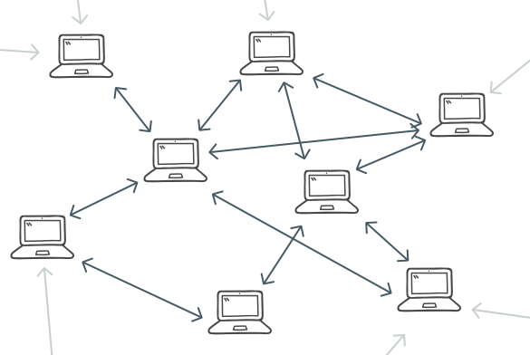

## Lập trình Blockchain với Golang. Part 7: Network

>Bài dịch từ _Building Blockchain in Go_ của tác giả _Ivan Kuznetsov_. Khi sử dụng vui lòng trích dẫn nguồn [@hlongvu](https://github.com/hlongvu/blockchain-go-vietnamese)


### Mục lục

1. [Lập trình Blockchain với Golang. Part 1: Cơ bản](https://github.com/hlongvu/blockchain-go-vietnamese/blob/master/Blockchain-go-part1.md)
2. [Lập trình Blockchain với Golang. Part 2: Proof-of-work](https://github.com/hlongvu/blockchain-go-vietnamese/blob/master/Blockchain-go-part2.md)
3. [Lập trình Blockchain với Golang. Part 3: Lưu trữ và tương tác CLI](https://github.com/hlongvu/blockchain-go-vietnamese/blob/master/Blockchain-go-part3.md)
4. [Lập trình Blockchain với Golang. Part 4: Transactions 1](https://github.com/hlongvu/blockchain-go-vietnamese/blob/master/Blockchain-go-part4.md)
5. [Lập trình Blockchain với Golang. Part 5: Address](https://github.com/hlongvu/blockchain-go-vietnamese/blob/master/Blockchain-go-part5.md) 
6. [Lập trình Blockchain với Golang. Part 6: Transaction 2](https://github.com/hlongvu/blockchain-go-vietnamese/blob/master/Blockchain-go-part6.md)
7. [Lập trình Blockchain với Golang. Part 7: Network](https://github.com/hlongvu/blockchain-go-vietnamese/blob/master/Blockchain-go-part7.md)


### Giới thiệu

Tới giờ chúng ta đã xây dựng được một blockchain với các tính năng chủ chốt như: ẩn danh, an toàn, địa chỉ ngẫu nhiên, lưu trữ dữu liệu, Proof-Of-Work, UTXO Set. Những tính năng này là thiết yếu, tuy nhiên vẫn chưa đủ. Thứ giúp cho những tính năng này nổi bật, thứ giúp tiền mã hoá có thể thành công đó là network. Thử hỏi chúng ta dùng blockchain làm gì nếu chỉ chạy trên một máy tính. Tiền mã hoá cũng có tác dụng gì nếu chỉ có một người sử dụng. Chính network là thứ khiến các tính năng này hữu dụng.

Các bạn có thể nghĩ tới blockchain như là các luật lệ, giống như trong cuộc sống con người có những quy tắc và luật riêng để cùng sinh sống và phát triển với nhau. Một loại trật tự xã hội. Mạng lưới blockchain chính là một cộng đồng các chương trình cùng theo một luật, cũng vì cùng tuân theo một luật này khiến cho mạng lưới tồn tại. Tương tự như loài người cùng có chung một lí tưởng thì sẽ trở nên mạnh mẽ hơn và có thể xây dựng một cuộc sống tốt đẹp hơn.
Nếu có ai đó lại đi theo các luật lệ khác, họ sẽ phải sống trong một xã hội khác. Cũng như vậy trong blockchain, nếu có một node đi theo một luật khác, nó cũng sẽ tạo nên một mạng lưới hoàn toàn khác.


Điều này rất quan trọng: Nếu không có network và số đông các node tham gia theo cùng một luật chung, thì những luật lệ này cũng vô tác dụng.

> Không may là tôi chưa có thời gian để xây dựng một mạng lưới P2P hoàn chỉnh. Trong phần này tôi chỉ đề cập tới một trường hợp thường gặp, đó là một network có các kiểu node khác nhau. Bổ sung thêm vào kiến trúc này để xây dựng một mạng P2P sẽ là phần dành cho bạn nghiên cứu và khám phá. Tôi cũng không dám chắc là phần code này có thể hoạt động trong những tình huống khác, ngoài những thứ đề cập trong phần này.
> 
> Hàm lượng code thay đổi là rất lớn nên các bạn có thể theo dõi tất cả ở [đây](https://github.com/Jeiwan/blockchain_go/compare/part_5...part_6#files_bucket)

### Blockchain Network - Mạng lưới blockchain

Blockchain network được phân tán (decentralized), nghĩa là không có server xử lí riêng, không có client lấy dữ liệu từ server. Trong blockchain network có các node, và mỗi node là một thành viên đầy đủ của cả hệ thống. Mỗi node đảm nhiệm cả server và client. Đây là điều cần nhớ vì nó sẽ rất khác với kiến trúc của web app.

Blockchain network là một P2P (Peer-to-Peer) network, có nghĩa là các node kết nối trực tiếp với nhau. Cấu trúc liên kết (topology) của nó là phẳng vì không có sự phân chia giữa các node. Hãy xem mô tả dưới đây:



Nodes trong hệ thống như vậy sẽ khó xây dựng hơn nhiều, vì chúng phải thực hiện rất nhiều chức năng. Mỗi node phải tương tác với nhiều node khác, yêu cầu trạng thái của node kia, so sánh với trạng thái của chính nó và thực hiện cập nhật.

### Node Roles

Mặc dù mỗi node đều là các thành viên đầy đủ, nhưng mỗi node có thể đảm nhiệm các chức năng khác nhau trong hệ thống. Đây là các loại:

1. Miner

	Những node này chạy trên những cỗ máy tính toán mạnh (như ASIC), và mục đích duy nhất của nó là tính toán để tìm ra block mới một cách nhanh nhất có thể. Chỉ có các blockchain có Proof-of-Work mới có miner, vì thực chất việc đào coin là giải các bài toán PoW. Trong blockchain sử dụng Proof-of-Stake thì không có việc đào.
	
2. Full node
	
	Những node này đảm nhiệm việc xác minh block được đào bởi miner và xác minh các transaction. Để làm được điều này, các full node phải có bản sao đầy đủ của blockchain. Cùng với đó, chúng cũng có nhiệm vụ định tuyến cho các node khác, giúp các node khác tìm thấy nhau.
	Việc có nhiều full node là rất cần thiết cho cả hệ thống, vì đây là những node đưa ra quyết định một block hay transaction có đúng hay không.
	
3. SPV

	Các SPV (Simplified Payment Verification) node không lưu toàn bộ bản sao của blockchain, nhưng chúng vẫn thực hiện việc xác minh (không phải tất cả mà chỉ một phần nhỏ hơn, ví dụ: chỉ xác minh các transaction gửi tới address xác định). Một node SPV phải dựa vào một full node để lấy dữ liệu. Nhiều node SPV có thể kết nối tới một full node. SPV giúp cho các ứng dụng ví có thể chạy được một cách dễ dàng hơn.
	
### Network Đơn Giản Hoá 
Để xây dựng blockchain của chúng ta, có một số tính năng cần đơn giản hoá. Vì chúng ta không có nhiều máy tính để mô phỏng cả network với nhiều node. Có thể sử dụng máy ảo (VM) hoặc Docker để giải quyết vấn đề này, tuy nhiên sẽ làm việc xây dựng trở nên phức tạp hơn. Vậy chúng ta vừa muốn chạy nhiều node trong cùng một máy, lại vừa muốn các node này hoạt động riêng biệt với nhau. Để làm điều này, chúng ta sẽ **dùng port làm id cho các node**, thay vì dùng IP. Ví dụ, sẽ có các node với địa chỉ: **127.0.0.1:3000**, **127.0.0.1:3001**, **127.0.0.1:3002**,... Chúng ta sử dụng port biến env (environment variable) **NODE_ID** để đặt tên cho các node. Sau đó chúng ta có thể bật nhiều cửa sổ terminal, đặt các **NODE_ID** khác nhau và chạy nhiều node.

Cách này cũng đòi hỏi phải sử dụng file dữ liệu khác nhau cho blockchain và wallet. Chúng sẽ có thêm **NODE_ID** trong các tên file như sau: **blockchain_3000.db**, **blockchain_30001.db**, **wallet_3000.db**, **wallet_30001.db**, ...

### Code

Điều gì xảy ra khi bạn tải Bitcoin Core và chạy chương trình lần đầu tiên? Nó sẽ phải kết nối tới node nào đó để tải bản sao mới nhất của blockchain. Vậy làm thế nào để máy tính của bạn biết được địa chỉ của các node để kết nối tới?

Hardcode địa chỉ node trong Bitcoin không phải là cách tốt, nếu node đó bị tấn công hoặc bị tắt, sẽ dẫn tới việc node mới không thể kết nối với mạng. Thay vào đó, Bitcoin Core sử dụng **DNS seeds**. Đây không phải là node mà là nơi để lấy địa chỉ của một số node. Khi bạn bật Bitcoin Core lần đầu tiên, nó sẽ kết nối tới các seeds này và lấy về một list các node để kết nối tới.

Trong blockchain của chúng ta sẽ có sự tập trung (centralization). Chúng ta sẽ có 3 nodes:

1. Central Node: Node trung tâm, các node còn lại sẽ kết nối tới, và gửi dữ liệu tới các node khác.
2. Miner Node: Node này sẽ lưu các transaction mới trong mempool và khi có đủ transaction sẽ tiến hành đào block mới.
3. Wallet node: Node này dùng để gửi coin giữa các wallet. Không giống với SPV, node này lưu giữ toàn bộ blockchain.

### Tình huống

Phần này chúng ta sẽ xây dựng hệ thống theo tình huống sau:
1. Central node sẽ tạo một blockchain
2. Các node khác (wallet) kết nối tới nó và tải toàn bộ blockchain
3. Một vài miner kết nối tới central node và tải toàn bộ blockchain
4. Wallet node tạo một transaction
5. Miner node nhận transaction và giữ trong mempool
6. Khi có đủ transaction trong mempool, miner bắt đầu đào block mới
7. Sau khi block được đào, nó được gửi cho central node
8. Wallet node sẽ đồng bộ cùng với central node
9. Người dùng ở wallet node sẽ kiểm tra xem việc gửi tiền có thành công hay không

Dù tình huống trên không xảy ra trên hệ thống P2P thực tế nhưng cũng là một use case quan trọng nhất giống với Bitcoin.

### Version

Các node giao tiếp với nhau thông qua các message. Khi một node mới chạy, nó lấy được một vài địa chỉ node khác qua DNS seed, gửi message **version**, như sau:

```
type version struct {
    Version    int
    BestHeight int
    AddrFrom   string
}
```

Chúng ta chỉ có một version blockchain, nên biến **Version** cũng không có thông tin gì quan trọng (trong Bitcoin có Main net và một số test net). **BestHeight** lưu độ cao của blockchain mà node đang có. **AddFrom** là địa chỉ của node gửi message.

Vậy khi một node nào đó nhận được message **version** nó sẽ trả lời như thế nào? Nó sẽ trả lời với một message **version** khác. Giống như việc bắt tay (hankshake): không cần làm việc gì khác trước khi chào nhau. Nhưng nó không vô nghĩa, **version** được dùng để xem ai có blockchain dài hơn. Khi một node nhận message **version**, nó sẽ kiểm tra xem blockchain mà nó đang lưu giữ có dài hơn **BestHeight** hay không. Nếu không, node đó sẽ yêu cầu và tải thêm các block còn thiếu.

Để nhận các message, chúng ta cần một server:

```
var nodeAddress string
var knownNodes = []string{"localhost:3000"}

func StartServer(nodeID, minerAddress string) {
    nodeAddress = fmt.Sprintf("localhost:%s", nodeID)
    miningAddress = minerAddress
    ln, err := net.Listen(protocol, nodeAddress)
    defer ln.Close()

    bc := NewBlockchain(nodeID)

    if nodeAddress != knownNodes[0] {
        sendVersion(knownNodes[0], bc)
    }

    for {
        conn, err := ln.Accept()
        go handleConnection(conn, bc)
    }
}
```

Chúng ta hard-code địa chỉ của central node. **minerAddress** là địa chỉ hưởng phần thưởng từ việc đào coin.

```
if nodeAddress != knownNodes[0] {
    sendVersion(knownNodes[0], bc)
}
```

Đoạn mã trên kiểm tra xem nó có phải là central node hay không, nếu không sẽ gửi message **version** tới central node để kiểm tra xem blockchain đã đồng bộ chưa.

```
func sendVersion(addr string, bc *Blockchain) {
    bestHeight := bc.GetBestHeight()
    payload := gobEncode(version{nodeVersion, bestHeight, nodeAddress})

    request := append(commandToBytes("version"), payload...)

    sendData(addr, request)
}
```

Các message của node là một mảng byte. 12 byte đầu tiên là mã lệnh (command), tiếp theo là mã hoá gob của message struct. Hàm **commandToBytes** như sau:

```
func commandToBytes(command string) []byte {
    var bytes [commandLength]byte

    for i, c := range command {
        bytes[i] = byte(c)
    }

    return bytes[:]
}
```

Nó tạo ra 12 byte buffer và đặt command vào đó, các byte còn lại rỗng. Một hàm ngược lại:

```
func bytesToCommand(bytes []byte) string {
    var command []byte

    for _, b := range bytes {
        if b != 0x0 {
            command = append(command, b)
        }
    }

    return fmt.Sprintf("%s", command)
}
```

Khi một node nhận được command, nó sẽ chạy hàm **bytesToCommand** lấy command ra. Tương tứng với mỗi command sẽ có một phần xử lí riêng:

```
func handleConnection(conn net.Conn, bc *Blockchain) {
    request, err := ioutil.ReadAll(conn)
    command := bytesToCommand(request[:commandLength])
    fmt.Printf("Received %s command\n", command)

    switch command {
    ...
    case "version":
        handleVersion(request, bc)
    default:
        fmt.Println("Unknown command!")
    }

    conn.Close()
}
```

Đây là phần xử lí cho command **version**:

```
func handleVersion(request []byte, bc *Blockchain) {
    var buff bytes.Buffer
    var payload version

    buff.Write(request[commandLength:])
    dec := gob.NewDecoder(&buff)
    err := dec.Decode(&payload)

    myBestHeight := bc.GetBestHeight()
    foreignerBestHeight := payload.BestHeight

    if myBestHeight < foreignerBestHeight {
        sendGetBlocks(payload.AddrFrom)
    } else if myBestHeight > foreignerBestHeight {
        sendVersion(payload.AddrFrom, bc)
    }

    if !nodeIsKnown(payload.AddrFrom) {
        knownNodes = append(knownNodes, payload.AddrFrom)
    }
}
```

Đầu tiên chúng ta cần giải mã yêu cầu và lấy nội dung version vào payload. Phần decode này tương tự nhau trong các handler, sẽ không trích dẫn nữa ở các bước tiếp.

Sau đó, node sẽ so sánh **BestHeight** của nó với giá trị trong message. Nếu dài hơn nó sẽ trả lời bằng message **version**, ngược lại nó sẽ gửi **getblocks**.

### getblocks

```
type getblocks struct {
    AddrFrom string
}
```

**getblocks** mang ý nghĩa "hãy cho tôi xem các block mà bạn có" (trong Bitcoin thì phức tạp hơn). Hãy chú ý, nó không nói "hãy đưa tôi tất cả block", thay vào đó nó chỉ yêu cầu các block hash. Như vậy để làm giảm tải hệ thống, block có thể tải từ nhiều node khác nhau, và chúng ta cũng không muốn tải cả Gb từ một nơi về.

Xử lí command này như sau:

```
func handleGetBlocks(request []byte, bc *Blockchain) {
    ...
    blocks := bc.GetBlockHashes()
    sendInv(payload.AddrFrom, "block", blocks)
}
```
Trong thiết kế đơn giản của chúng ta, node sẽ trả về tất cả block hash.

### inv

```
type inv struct {
    AddrFrom string
    Type     string
    Items    [][]byte
}
```
Bitcoin sử dụng **inv** để cho các nodes khác xem block và transaction mà nó đang có. Cũng như trên, nó không chứa toàn bộ block và transaction mà chỉ là các hash. Trường **Type** cho phép chúng ta biết đó là block hay transaction.

Xử lí **inv** phức tạp hơn đôi chút:

```
func handleInv(request []byte, bc *Blockchain) {
    ...
    fmt.Printf("Recevied inventory with %d %s\n", len(payload.Items), payload.Type)

    if payload.Type == "block" {
        blocksInTransit = payload.Items

        blockHash := payload.Items[0]
        sendGetData(payload.AddrFrom, "block", blockHash)

        newInTransit := [][]byte{}
        for _, b := range blocksInTransit {
            if bytes.Compare(b, blockHash) != 0 {
                newInTransit = append(newInTransit, b)
            }
        }
        blocksInTransit = newInTransit
    }

    if payload.Type == "tx" {
        txID := payload.Items[0]

        if mempool[hex.EncodeToString(txID)].ID == nil {
            sendGetData(payload.AddrFrom, "tx", txID)
        }
    }
}
```

Nếu là block hash được gửi tới, chúng ta sẽ lưu lại vào **blocksInTransit**. Điều này cho phép chúng ta theo dõi và tải block từ các node khác nhau. Sau khi đặt block vào trạng thái inTransit, chúng ta gửi command **getdata** ngược lại để cập nhật **blocksInTransit**. Trong thực tế hệ thống P2P, chúng ta sẽ tải các block từ nhiều node khác nhau.

Thiết kế của chúng ta không gửi **inv** với nhiều hash. Đó là lý do khi check **payload.Type == "tx"** cũng chỉ hash đầu tiên được lấy. Sau đó chúng ta kiểm tra xem hash đó đã có trong mempool chưa, nếu chưa **getdata** được gửi đi.


### getdata

```
type getdata struct {
    AddrFrom string
    Type     string
    ID       []byte
}
```

Hàm **getdata** yêu cầu một block hoặc transaction, và nó chỉ chứa được một block/transaction id.

```
func handleGetData(request []byte, bc *Blockchain) {
    ...
    if payload.Type == "block" {
        block, err := bc.GetBlock([]byte(payload.ID))

        sendBlock(payload.AddrFrom, &block)
    }

    if payload.Type == "tx" {
        txID := hex.EncodeToString(payload.ID)
        tx := mempool[txID]

        sendTx(payload.AddrFrom, &tx)
    }
}
```

Hàm xử lí **getdata** khá đơn giản: nếu yêu cầu block thì trả về block, nếu yêu cầu transaction thì trả về transaction. Chú ý, chúng ta không kiểm tra xem node có chưa block hay transaction đó không. Đây là 1 lỗi :)

### block and tx

```
type block struct {
    AddrFrom string
    Block    []byte
}

type tx struct {
    AddFrom     string
    Transaction []byte
}
```
Đây là hai message gửi dữ liệu.

Khi nhận được block:


```
func handleBlock(request []byte, bc *Blockchain) {
    ...

    blockData := payload.Block
    block := DeserializeBlock(blockData)

    fmt.Println("Recevied a new block!")
    bc.AddBlock(block)

    fmt.Printf("Added block %x\n", block.Hash)

    if len(blocksInTransit) > 0 {
        blockHash := blocksInTransit[0]
        sendGetData(payload.AddrFrom, "block", blockHash)

        blocksInTransit = blocksInTransit[1:]
    } else {
        UTXOSet := UTXOSet{bc}
        UTXOSet.Reindex()
    }
}
```

Khi nhận được block, chúng ta đặt nó vào blockchain. Nếu có thêm block cần tải, chúng ta lại tiếp tục yêu cầu từ node mới gửi. Khi blockchain đã đồng bộ đầy đủ, UTXO Set sẽ reindex.

> TODO: Thay vì tin tưởng block gửi tới vô điều kiện, chúng ta phải xác minh block mới nhận được có đúng hay không trước khi cho vào blockchain.
> 
> TODO: Thay vì chạy UTXOSet.Reindex(), hãy chạy UTXOSet.Update(block) đối với mỗi block nhận được để giảm thiểu việc quét qua cả blockchain lãng phí.


Khi nhận được message **tx** cần xử lí khá nhiều:

```
func handleTx(request []byte, bc *Blockchain) {
    ...
    txData := payload.Transaction
    tx := DeserializeTransaction(txData)
    mempool[hex.EncodeToString(tx.ID)] = tx

    if nodeAddress == knownNodes[0] {
        for _, node := range knownNodes {
            if node != nodeAddress && node != payload.AddFrom {
                sendInv(node, "tx", [][]byte{tx.ID})
            }
        }
    } else {
        if len(mempool) >= 2 && len(miningAddress) > 0 {
        MineTransactions:
            var txs []*Transaction

            for id := range mempool {
                tx := mempool[id]
                if bc.VerifyTransaction(&tx) {
                    txs = append(txs, &tx)
                }
            }

            if len(txs) == 0 {
                fmt.Println("All transactions are invalid! Waiting for new ones...")
                return
            }

            cbTx := NewCoinbaseTX(miningAddress, "")
            txs = append(txs, cbTx)

            newBlock := bc.MineBlock(txs)
            UTXOSet := UTXOSet{bc}
            UTXOSet.Reindex()

            fmt.Println("New block is mined!")

            for _, tx := range txs {
                txID := hex.EncodeToString(tx.ID)
                delete(mempool, txID)
            }

            for _, node := range knownNodes {
                if node != nodeAddress {
                    sendInv(node, "block", [][]byte{newBlock.Hash})
                }
            }

            if len(mempool) > 0 {
                goto MineTransactions
            }
        }
    }
}
```

Điều đầu tiên cần làm là đặt transaction vào mempool ( như trên, transaction cũng cần xác minh trước khi cho vào mempool). Sau đó:

```
if nodeAddress == knownNodes[0] {
    for _, node := range knownNodes {
        if node != nodeAddress && node != payload.AddFrom {
            sendInv(node, "tx", [][]byte{tx.ID})
        }
    }
}
``` 

Kiểm tra xem node hiện tại có phải là central node không. Trong thiết kế của chúng ta, central node không đào block mới mà gửi các transaction mới tới node khác trong network.

Bước tiếp theo chỉ dành cho miner:

```
if len(mempool) >= 2 && len(miningAddress) > 0 {

```
**miningAddress** chỉ được thiết lập tại miner node. Khi có 2 transaction hoặc nhiều hơn trong mempool thì tiến trình đào sẽ được bắt đầu.

```
for id := range mempool {
    tx := mempool[id]
    if bc.VerifyTransaction(&tx) {
        txs = append(txs, &tx)
    }
}

if len(txs) == 0 {
    fmt.Println("All transactions are invalid! Waiting for new ones...")
    return
}
```
Đầu tiên các transaction trong mempool được xác minh. Transaction sai sẽ bị bỏ qua, nếu không có transaction nào thì tiến trình đào bị bỏ qua.

```
cbTx := NewCoinbaseTX(miningAddress, "")
txs = append(txs, cbTx)

newBlock := bc.MineBlock(txs)
UTXOSet := UTXOSet{bc}
UTXOSet.Reindex()

fmt.Println("New block is mined!")

```

Các transaction đúng được cho vào block, cũng như coinbase transaction. Sau khi đào được block, UTXO Set được cập nhật.

> TODO: Tương tự như trên, UTXOSet.Update nên được dùng thay vì UTXOSet.Reindex


```
for _, tx := range txs {
    txID := hex.EncodeToString(tx.ID)
    delete(mempool, txID)
}

for _, node := range knownNodes {
    if node != nodeAddress {
        sendInv(node, "block", [][]byte{newBlock.Hash})
    }
}

if len(mempool) > 0 {
    goto MineTransactions
}
```
Sau khi transaction được đào, nó được bỏ ra khỏi mempool. Các node khác sẽ được gửi message **inv** với mã block hash mới. Các node đó sẽ có thể yêu cầu block đó sau khi xử lí message.

### Result

Hãy chạy chương trình theo tình huống chúng ta đã đưa ra ở trên:

Đầu tiên chạy node với **NODE_ID = 3000** (export NODE_ID=3000) trong terminal 1. Để tóm tắt chúng ta sẽ gọi tắt là **NODE 3000** hoặc **NODE 3001** để các bạn có thể biết các thao tác trên node nào.


**NODE 3000**

Tạo wallet và blockchain mới:

```
$ blockchain_go createblockchain -address CENTREAL_NODE

```

( Tôi sử dụng address giả để cho tiện và dễ theo dõi)

Sau đó blockchain sẽ chỉ có genesis block. Chúng ta cần lưu lại block và dùng trong các node khác. Genesis block được dùng để làm định danh cho blockchain ( trong Bitcoin Core, genesis block được hard code).

```
$ cp blockchain_3000.db blockchain_genesis.db 

```

**NODE 3001**

Mở tiếp một terminal và đặt NODE ID bằng 3001. Đây là wallet node. Khởi tạo một số address với **blockchain_go createwallet**, chúng ta gọi các ví này là **WALLET_1**, **WALLET_2**, **WALLET_3**.


**NODE 3000**

Gửi coin tới các wallet:

```
$ blockchain_go send -from CENTREAL_NODE -to WALLET_1 -amount 10 -mine
$ blockchain_go send -from CENTREAL_NODE -to WALLET_2 -amount 10 -mine
```

Cờ **-mine** mang ý nghĩa block sẽ được đào ngay trong node đó. Chúng ta phải có cờ này vì ban đầu chưa có miner node nào trong mạng. Khởi động node:

```
$ blockchain_go startnode

```

Node này sẽ chạy cho tới cuối cùng.


**NODE 3001**

Chạy node với genesis block được lưu ở trên:

```
$ cp blockchain_genesis.db blockchain_3001.db
$ blockchain_go startnode

```

Nó sẽ tải các block từ central node. Để kiểm tra xem mọi thứ có hoạt động không, dừng node lại và kiểm tra balance:

```
$ blockchain_go getbalance -address WALLET_1
Balance of 'WALLET_1': 10

$ blockchain_go getbalance -address WALLET_2
Balance of 'WALLET_2': 10
```

Đồng thời bạn cũng có thể kiểm tra balance của central node, bởi node 3001 này cũng đã cập nhật blockchain:

```
$ blockchain_go getbalance -address CENTRAL_NODE
Balance of 'CENTRAL_NODE': 10
```

**NODE 3002**

Mở một cửa sổ mới và đặt NODE_ID bằng 30002, tạo một wallet mới. Đây sẽ là miner node. Khởi tạo blockchain và chạy node:

```
$ cp blockchain_genesis.db blockchain_3002.db
$ blockchain_go startnode -miner MINER_WALLET

```


**NODE 3001**

Gửi tiền:

```
$ blockchain_go send -from WALLET_1 -to WALLET_3 -amount 1
$ blockchain_go send -from WALLET_2 -to WALLET_4 -amount 1
```

**NODE 3002**

Hãy chuyển nhanh sang miner node để xem nó đang đào block mới. Đồng thời kiểm tra ouput của central node.


**NODE 3001**

Chuyển sang wallet node và chạy:

```
$ blockchain_go startnode
```
Nó sẽ tải về block mới. Sau đó dừng lại và kiểm tra balance:

```
$ blockchain_go getbalance -address WALLET_1
Balance of 'WALLET_1': 9

$ blockchain_go getbalance -address WALLET_2
Balance of 'WALLET_2': 9

$ blockchain_go getbalance -address WALLET_3
Balance of 'WALLET_3': 1

$ blockchain_go getbalance -address WALLET_4
Balance of 'WALLET_4': 1

$ blockchain_go getbalance -address MINER_WALLET
Balance of 'MINER_WALLET': 10
```

Vậy là xong!

### Kết luận

Đây là phần cuối của seri. Tôi có thể làm thêm phần P2P tuy nhiên không có đủ thời gian. Hy vọng loạt bài này giúp trả lời các câu hỏi của các bạn về hệ thống Bitcoin, cũng như mang đến nhiều câu hỏi mới mà các bạn có thể tự tìm câu trả lời. Còn có nhiều điều hấp dẫn giấu trong công nghệ của Bitcoin! Chúc may mắn!

P.S. Bạn có thể nâng cao hệ thống này hơn bằng việc thiết kế message **addr**, được đặc tả trong Bitcoin như link dưới đây, giúp các node có thể tìm thấy nhau. Tôi đã bắt tay cài đặt nhưng còn chưa xong!

### Links

1. [Source codes](https://github.com/Jeiwan/blockchain_go/tree/part_7)
2. [Bitcoin protocol documentation](https://en.bitcoin.it/wiki/Protocol_documentation)
3. [Bitcoin network](https://en.bitcoin.it/wiki/Network)


>Bài dịch từ _Building Blockchain in Go_ của tác giả _Ivan Kuznetsov_. Khi sử dụng vui lòng trích dẫn nguồn [@hlongvu](https://github.com/hlongvu/blockchain-go-vietnamese)


### Mục lục

1. [Lập trình Blockchain với Golang. Part 1: Cơ bản](https://github.com/hlongvu/blockchain-go-vietnamese/blob/master/Blockchain-go-part1.md)
2. [Lập trình Blockchain với Golang. Part 2: Proof-of-work](https://github.com/hlongvu/blockchain-go-vietnamese/blob/master/Blockchain-go-part2.md)
3. [Lập trình Blockchain với Golang. Part 3: Lưu trữ và tương tác CLI](https://github.com/hlongvu/blockchain-go-vietnamese/blob/master/Blockchain-go-part3.md)
4. [Lập trình Blockchain với Golang. Part 4: Transactions 1](https://github.com/hlongvu/blockchain-go-vietnamese/blob/master/Blockchain-go-part4.md)
5. [Lập trình Blockchain với Golang. Part 5: Address](https://github.com/hlongvu/blockchain-go-vietnamese/blob/master/Blockchain-go-part5.md) 
6. [Lập trình Blockchain với Golang. Part 6: Transaction 2](https://github.com/hlongvu/blockchain-go-vietnamese/blob/master/Blockchain-go-part6.md)
7. [Lập trình Blockchain với Golang. Part 7: Network](https://github.com/hlongvu/blockchain-go-vietnamese/blob/master/Blockchain-go-part7.md)